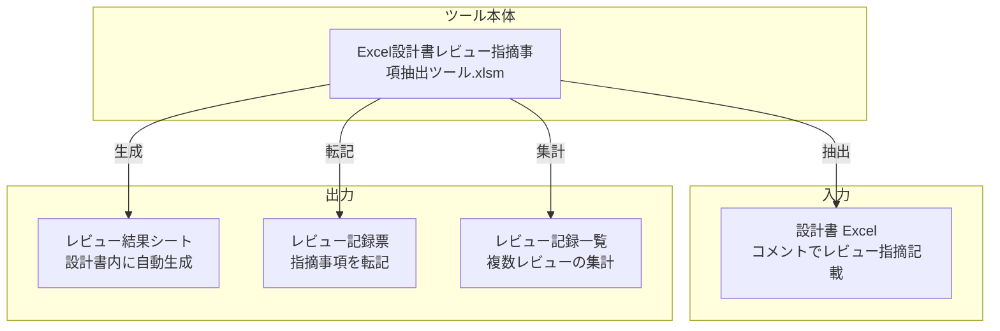
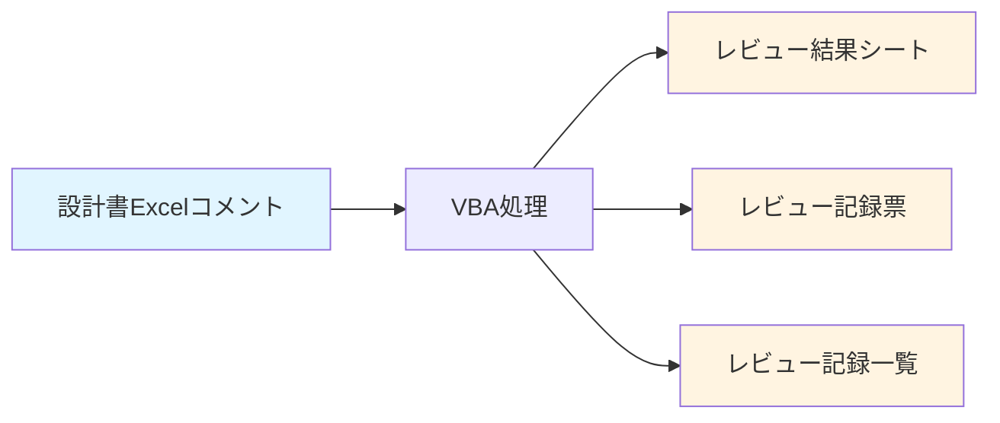

# 概要・アーキテクチャ・Excelシート構造

---

## 概要

### 目的

Excel 設計書に記載されたレビュー指摘事項（Excel コメント）を自動的に抽出し、レビュー記録票へ転記するツール。レビュー作業の効率化と、設計書とレビュー記録票を行き来する手間を削減することを目的とする。

### 主要機能

1. **レビュー指摘事項の抽出**: Excel 設計書のコメントからレビュー指摘を自動抽出
2. **レビュー記録票への転記**: 抽出した指摘事項をレビュー記録票に自動転記
3. **レビュー記録一覧への集計**: 複数のレビュー結果を一覧にまとめて管理
4. **レビュー結果シートの自動生成**: 設計書内にレビュー結果のサマリシートを生成
5. **コメント・シートの一括削除**: レビュー結果の削除機能

### ツール構成ファイル

| ファイル名 | 説明 |
|-----------|------|
| `Excel設計書レビュー指摘事項抽出ツール.xlsm` | 本ツール（VBAマクロ含む） |
| `レビュー記録サマリ.xlsx` | レビューのサマリを記載する簡易的なフォーマット |
| `システム機能設計書_サンプル.xlsx` | レビュー指摘事項を記載済みの設計書サンプル |
| `システム機能設計書_サンプル_レビュー記録票.xlsx` | レビュー記録票のサンプル |

---

## アーキテクチャ

### システム構成

### データフロー概要

---

## Excelシート構造

### シート一覧

| # | シート名 | 表示 | 用途 |
|---|---------|------|------|
| 1 | 改版履歴 | 表示 | ツールのバージョン管理 |
| 2 | 利用ガイド | 表示 | ツールの使い方の説明 |
| 3 | レビュー指摘事項抽出 | 表示 | **メイン操作画面**（ユーザーがここで操作） |
| 4 | 基本設定 | 表示 | ツールの基本設定 |
| 5 | 項目マッピング設定 | 表示 | レビュー記録票への転記位置設定 |
| 6 | 指摘分類マッピング設定 | 表示 | 指摘分類のエイリアス設定（a～i → 実際の分類名） |
| 7 | これより右はツールが使用するシート | 表示 | 境界シート（視覚的な区切り） |
| 8 | 項目マッピング設定ガイド | 非表示 | 設定の詳細ガイド |
| 9 | レビュー結果シートテンプレート | 表示 | 結果シートのテンプレート |
| 10 | エラーシートテンプレート | 表示 | エラーシートのテンプレート |

### 主要シートの詳細

#### 1. レビュー指摘事項抽出シート（メイン操作画面）

**配置要素**:

- **レビュー回数入力欄**: G4 セル
- **レビュー記録一覧ファイルパス**: G8 セル
- **レビュー記録一覧シート名**: G10 セル
- **一覧への反映値**:
  - 工程: G14 セル（固定値）またはシート名/セル位置で参照
  - レビュア: G16 セル（固定値）またはシート名/セル位置で参照
  - レビュイ: G18 セル（固定値）またはシート名/セル位置で参照
- **ボタン**:
  - `CmdGen`: レビュー指摘事項抽出ボタン（メイン処理）

**名前付きセル**:

| 名前 | セル | 用途 |
|------|------|------|
| `REVIEW_TIMES` | G4 | レビュー回数 |
| `REVIEW_LIST_FILEPATH` | G8 | レビュー記録一覧ファイルパス |
| `REVIEW_LIST_SHEET` | G10 | レビュー記録一覧シート名 |
| `REVIEW_LIST_PHASE` | G14 | 工程（固定値） |
| `REVIEW_LIST_REVIEWER` | G16 | レビュア（固定値） |
| `REVIEW_LIST_REVIEWEE` | G18 | レビュイ（固定値） |

#### 2. 基本設定シート

| 設定項目 | セル | デフォルト値 | 説明 |
|---------|------|------------|------|
| レビュー記録票の使用 | B2 | TRUE | レビュー記録票への転記を行うか |
| レビュー記録サマリの使用 | B3 | FALSE | レビュー記録サマリ.xlsxを使用するか |
| 処理対象Excelブック名 | B4 | `.*機能設計書.*` | 処理対象ファイル名の正規表現 |
| 処理対象外Excelブック名 | B5 | `.*レビュー記録票.*` | 処理対象外ファイル名の正規表現 |

#### 3. 項目マッピング設定シート

レビュー記録票への転記位置を設定するシート。3 つのセクションに分かれている：

- **ヘッダ**: レビューの概要（1 回のレビューにつき固定位置に書き込み）
- **サマリ**: レビューの概要（1 回のレビューにつき 1 行追加）
- **指摘一覧**: 指摘事項の一覧（1 指摘につき 1 行追加）

#### 4. 指摘分類マッピング設定シート

コメントで使用するエイリアス（a～i）と実際の指摘分類名のマッピング：

| エイリアス | 指摘分類 |
|-----------|---------|
| a | 01_要件漏れ |
| b | 02_要件誤り |
| c | 11_機能・仕様漏れ |
| d | 12_機能・仕様誤り |
| e | 21_設計・ドキュメント規約違反 |
| f | 22_記述誤り |
| g | 91_疑問点、確認 |
| h | 92_改善要望 |
| i | 93_仕様変更 |
