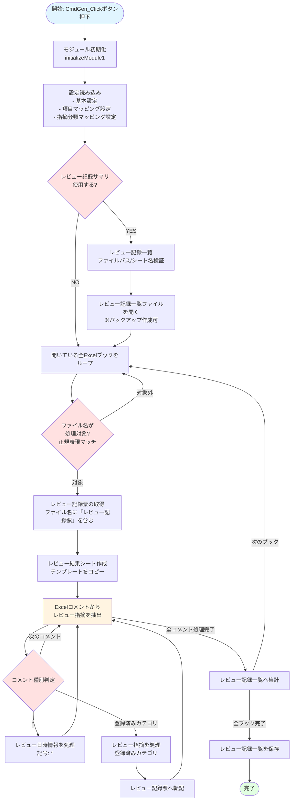
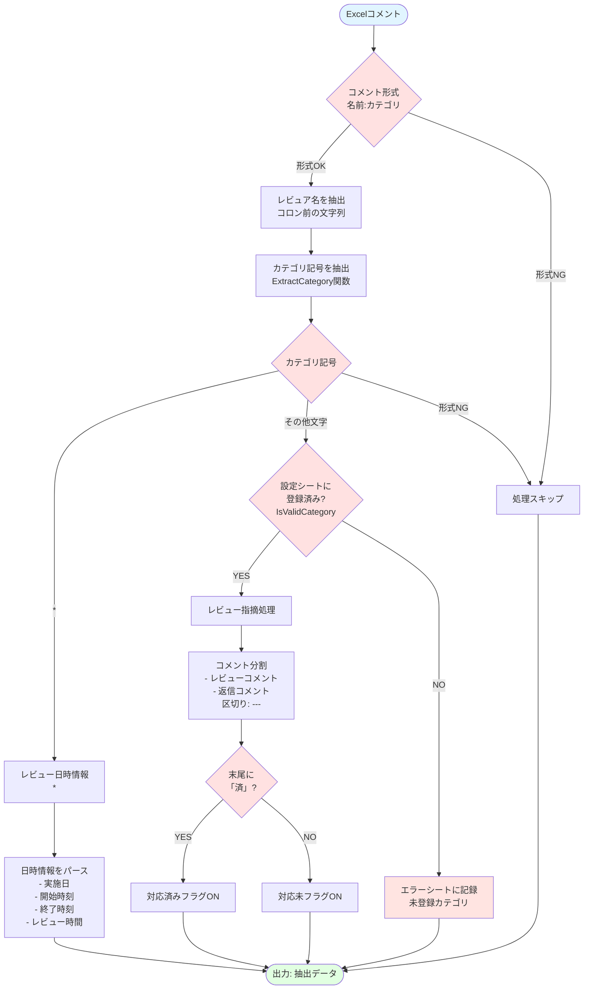
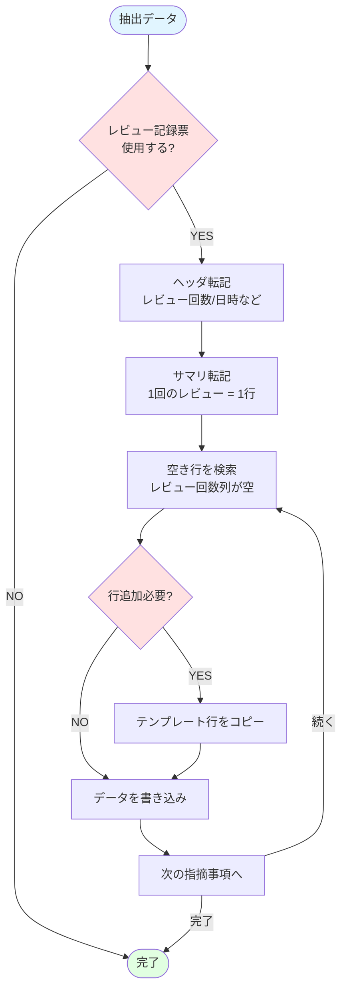
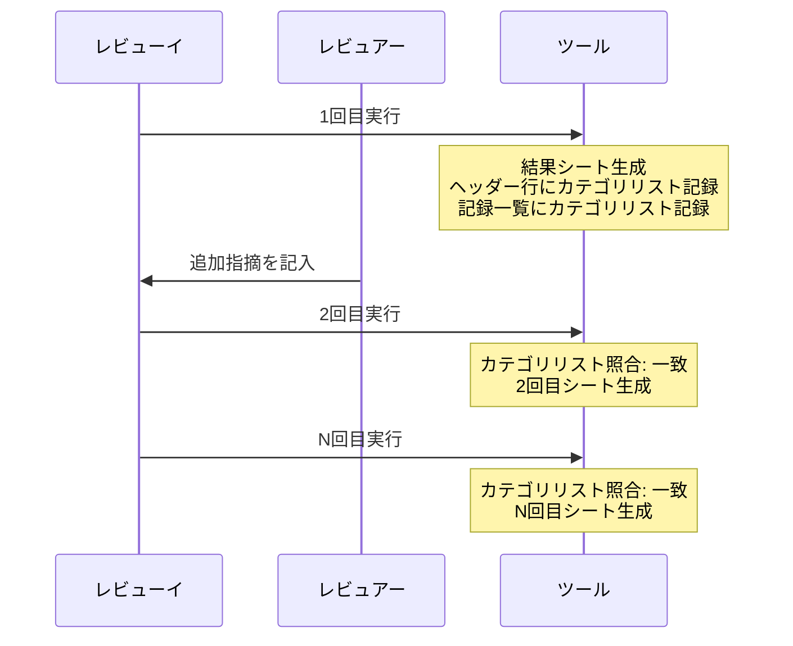
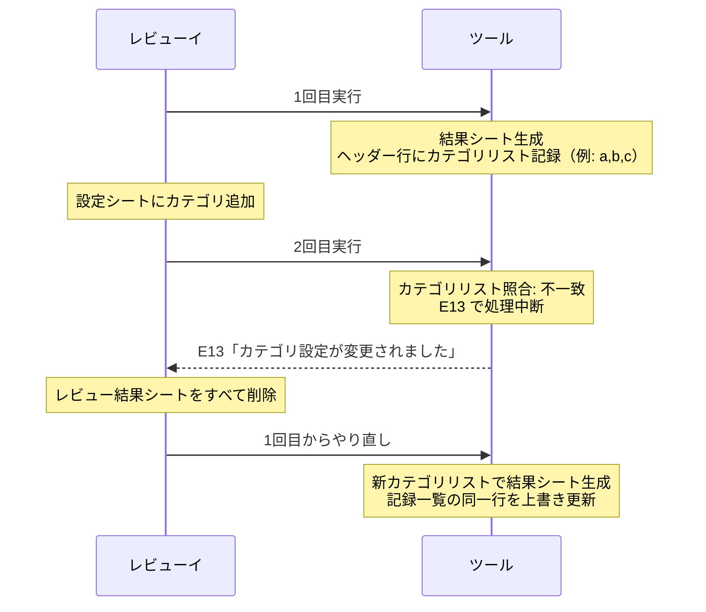

# 主要な処理フロー・詳細処理仕様・データフロー

---

## 主要な処理フロー

### メイン処理フロー（CmdGen_Click）



### コメント解析フロー



### レビュー記録票への転記フロー



---

## 詳細処理仕様

### CmdGen_Click（メイン処理）の詳細

#### 1. 初期化フェーズ

```vba
' カーソルを待機状態に
Application.Cursor = xlWait

' モジュール初期化（正規表現オブジェクト作成）
initializeModule1
```

**処理内容**:

- 正規表現オブジェクト（`VBScript.RegExp`）を作成
- コメント分割用のパターン `^---+$` を設定

#### 2. 設定読み込みフェーズ

**`[ツール本体] 基本設定` シートの読み込み**:

- `B2`: レビュー記録票の使用（TRUE/FALSE）
- `B3`: レビュー記録サマリの使用（TRUE/FALSE）
- `B4`: 処理対象 Excel ブック名の正規表現
- `B5`: 処理対象外 Excel ブック名の正規表現

**`[ツール本体] 項目マッピング設定` シートの読み込み**:

- ヘッダ、サマリ、指摘一覧の各項目について、転記先のシート名/列/行を読み込み

**`[ツール本体] 指摘分類マッピング設定` シートの読み込み**:

- エイリアスと実際の指摘分類名の Dictionary を作成
- `categoryMappings` として保持し、`IsValidCategory` でカテゴリ検証に使用

#### 3. レビュー記録サマリの処理（[レビュー記録サマリ] ブックのオープン）

**バックアップ作成（オプション）**:

```vba
If CbBkup = True Then
    bkupFileNm = Replace(reviewListFileNm, extension, "") _
        & "_" & Format(Date, "yyyyMMdd") _
        & "_" & Format(Time, "hhmmss") & extension
    FileCopy reviewListFilepath, Replace(reviewListFilepath, reviewListFileNm, "") & bkupFileNm
End If
```

**ファイルを開く**:

```vba
Set reviewListBook = Workbooks.Open(Filename:=reviewListFilepath, UpdateLinks:=0, IgnoreReadOnlyRecommended:=True)
```

#### 4. 処理対象ブックのループ

```vba
For Each book In Application.Workbooks
    If targetBookNamePattern.test(book.Name) And Not noTargetBookNamePattern.test(book.Name) Then
        ' 処理対象のブック
    End If
Next book
```

**フィルタリング**:

1. `[ツール本体] 基本設定 B4` の正規表現にマッチ
2. `[ツール本体] 基本設定 B5` の正規表現にマッチしない
3. 例: `.*機能設計書.*` にマッチし、`.*レビュー記録票.*` にマッチしない

#### 5. コメント抽出ループ

```vba
For Each s In book.Worksheets
    For Each cmnt In s.comments
        ' コメント処理
    Next cmnt
Next s
```

**コメント形式の検証**:

- コメントに `:`（コロン）が含まれる
- コメントに改行（`vbLf`）が含まれる

**コメント種別の判定**:

```vba
reviewer = Left(commentText, InStr(1, StrConv(commentText, vbNarrow), ":") - 1)
category = ExtractCategory(commentText)
```

- `category = "*"`: レビュー日時情報
- `IsValidCategory(category, categoryMappings) = True`: レビュー指摘事項

#### 6. レビュー日時情報の処理（category = "*"）

**コメントフォーマット**:

```
山田太郎:*
実施日 2023/12/01
開始 13:00
終了 15:00
レビュー時間 2:00
```

**抽出処理**:

```vba
reviewDate = Mid(commentText, InStr(1, commentText, "実施日") + 4, ...)
reviewStartTime = Mid(commentText, InStr(1, commentText, "開始") + 3, ...)
reviewEndTime = Mid(commentText, InStr(1, commentText, "終了") + 3, ...)
reviewTime = Mid(commentText, InStr(1, commentText, "レビュー時間") + 7, ...)
```

**書き込み先**:

- `[処理対象設計書] レビュー結果N回目` シートのヘッダ部分
- `[レビュー記録票]` ヘッダシート・サマリシート

**複数回レビューへの対応**:

`*` コメントは設計書内に複数置くことができる。走査は「シート左タブから右タブ順」×「各シート内で左上から右下（行番号昇順、同行内は列番号昇順）」の順で処理されるため、**最後に走査された `*` コメントの日時が採用される（それ以前のものは上書き）**。

この特性を利用して、各レビュー回の日時を別セルに順番に記録していく運用が可能：

```
セルA1: 山田太郎:*          ← 1回目の日時（2026/03/01）
          実施日 2026/03/01
          ...

セルA2: 山田太郎:*          ← 2回目の日時（2026/03/10）←後から追記
          実施日 2026/03/10
          ...
```

| 実行タイミング | 存在する `*` コメント | 採用される日時 | 記録先 |
|-------------|---------------------|--------------|-------|
| 1回目の抽出 | A1 のみ | 2026/03/01 | `[処理対象設計書] レビュー結果1回目` |
| 2回目の抽出 | A1 と A2 | A2 = 2026/03/10（最後） | `[処理対象設計書] レビュー結果2回目` |

1回目の日時は「レビュー結果1回目」シートに記録済みなので、2回目の抽出で A1 が上書きされても情報は失われない。

> **注意**: `For Each cmnt In s.Comments` の走査順序は VBA の公式仕様として保証されていない。一般的にはセルの位置順（左上から右下）だが、コメントを追加した順序に依存する可能性がある。上記の運用をする場合は、**後から追記する日時コメントを、既存の `*` コメントより下のセルに置く**ことを推奨する。

#### 7. レビュー指摘の処理（登録済みカテゴリ）

**コメントフォーマット**:

```
山田太郎:a
指摘内容がここに記載される
複数行可能
---
対応内容（レビュイが記載）
済
```

**処理内容**:

1. `splitComment()` でレビューコメントと返信コメントに分割
2. 末尾に「済」があれば対応済みフラグ ON
3. `extractCloseLine()` で「済」を含む行を抽出
4. `[処理対象設計書] レビュー結果N回目` シートに書き込み
5. `[レビュー記録票]` の各シートへ転記

#### 8. レビュー記録票への転記

転記先は**レビュー記録票ブック**（ファイル名が `*レビュー記録票*` にマッチするブック）内の 3 シート。
各シート名は `[ツール本体] 項目マッピング設定` で設定する。

**① ヘッダシートへの転記**（設定: 項目マッピング設定 B2 列のシート名）:

- 転記先: `[レビュー記録票] ヘッダシート`
- 書き込み内容: レビュー回数・実施日・開始/終了時刻・レビュー時間・工程・ページ数・レビュア・レビュイ
- 書き込み方式: 設定で指定したセル番地へ直接書き込み（行管理なし、常に上書き）

**② サマリシートへの転記**（設定: 項目マッピング設定 F2 列のシート名、F3 行の開始行）:

- 転記先: `[レビュー記録票] サマリシート`
- 書き込み単位: 1 回のレビューにつき 1 行
- 行の探し方: 開始行から下に向かって「レビュー回数列が空 または 現在の回数と同じ」行を探す
  - **空の行を見つけた場合**（新規回数）: A 列が空であればテンプレート行をコピーして行挿入してから書き込む
  - **同じ回数の行を見つけた場合**（重複実行）: 行挿入せずそのまま上書き
  - 前の回（回数 - 1）が存在しない場合は E07 エラーで中断

**③ 指摘一覧シートへの転記**（設定: 項目マッピング設定 I2 列のシート名、I3 行の開始行）:

- 転記先: `[レビュー記録票] 指摘一覧シート`
- 書き込み単位: 1 指摘につき 1 行
- 行の探し方と書き込み方式:
  - **重複実行（上書き）時**: 同じレビュー回数の既存行をすべて削除してから書き込み直す（旧カテゴリ行の残留を防ぐ）
  - **新規回数の場合**: レビュー回数列が空の行にテンプレート行をコピーして行挿入し、1 指摘ごとに 1 行ずつ追加

#### 9. レビュー記録一覧への集計

転記先は**レビュー記録サマリブック**（`REVIEW_LIST_FILEPATH` で指定）内の `REVIEW_LIST_SHEET` で指定されたシート（既定: `レビュー記録一覧`）。
すなわち `[レビュー記録サマリ] レビュー記録一覧` シートへ集計する。

**集計項目**:

- No.（連番）
- 工程
- 文書 ID
- 対象ファイル
- 作成者
- レビュー回数
- 前回文書 ID
- ページ数
- レビュー日付
- 開始時刻
- 終了時刻
- レビュー時間
- レビュア
- レビュイ
- レビュー方式
- 指摘分類ごとの件数（登録済みカテゴリ・動的）
- 合計件数
- レビュー結果
- 再レビュー方式

### カテゴリリスト管理

2026-03-31 バージョンよりカテゴリ数が動的になるため、**カテゴリリストを2箇所のヘッダー行に記録し、実行のたびに照合**する。

#### カテゴリリストの書き込み先

| 書き込み先 | 位置 | タイミング |
|-----------|------|---------|
| `[処理対象設計書] レビュー結果N回目` | `ROW_CATEGORY - 1` 行（9行目）、`COL_CATEGORY_START`（B列）から順に | 初回シート生成時 |
| `[レビュー記録サマリ] レビュー記録一覧` | 1行目、`DETAIL_COL_LIST_CATEGORY_START`（AC列）から順に | 初回転記時 |

#### カテゴリ変更の検出

2回目以降の実行では、上記ヘッダー行を走査して得たカテゴリリスト（順序付き文字列）と現在の `[ツール本体] 指摘分類マッピング設定` シートのリストを比較する。**カテゴリの追加・削除・順序変更のいずれも不一致として検出**し、E13 で処理中断する。

#### 正常フロー（カテゴリ変更なし）



#### カテゴリ変更エラー発生時のフロー



### splitComment関数の詳細

```vba
Public Function splitComment(comment As String) As String()
    Dim lines() As String
    Dim reviewComment() As String
    Dim replyComment() As String

    lines = Split(comment, vbLf)

    For Each s In lines()
        If re.test(s) Then  ' ---にマッチ
            matched = True
        Else
            If matched Then
                ' 返信コメント
                ReDim Preserve replyComment(UBound(replyComment) + 1)
                replyComment(UBound(replyComment)) = s
            Else
                ' レビューコメント
                ReDim Preserve reviewComment(UBound(reviewComment) + 1)
                reviewComment(UBound(reviewComment)) = s
            End If
        End If
    Next s

    rc(1) = Join(reviewComment, vbCrLf)
    rc(2) = Join(replyComment, vbCrLf)

    splitComment = rc()
End Function
```

**処理フロー**:

1. コメントを改行で分割
2. `---` パターンを検出するまでがレビューコメント
3. `---` パターン以降が返信コメント
4. 2 つの配列に分けて返す

---

## データフロー

### 入力データ

#### Excelコメントフォーマット

**レビュー日時情報**:

```
<レビュア名>:*
実施日 YYYY/MM/DD
開始 HH:MM
終了 HH:MM
レビュー時間 HH:MM
```

**レビュー指摘事項**:

```
<レビュア名>:<分類記号（[ツール本体] 指摘分類マッピング設定 のエイリアス）>
<指摘内容>
（複数行可）
---
<対応内容>
（複数行可）
<済>（対応完了時）
```

### 出力データ

#### [処理対象設計書] レビュー結果N回目シート

**ヘッダ部**:

| 項目 | セル位置 | 説明 |
|------|---------|------|
| 文書ID | B2 | 自動採番（D00001形式） |
| 対象ファイル | A4 | 処理対象のExcelファイル名 |
| レビュー回数 | C4 | 何回目のレビューか |
| 実施日 | E4 | レビュー実施日 |
| 開始 | F4～G4 | レビュー開始時刻 |
| 終了 | H4 | レビュー終了時刻 |
| レビュー時間 | I4 | レビュー時間 |

**指摘件数サマリ**:

| 項目 | 行 | 説明 |
|------|---|------|
| カテゴリヘッダー | 9行 | 指摘分類のエイリアス（B列～） |
| 対応状況（済/未） | 10～11行 | 指摘分類ごとの件数 |
| 計 | 12行 | 合計 |

**指摘詳細**:

| 列 | 項目 | 説明 |
|---|------|------|
| A | シート | コメントがあるシート名 |
| B | 場所 | コメントのセル位置 |
| C | 指摘者 | レビュア名 |
| D | 指摘種別 | 指摘分類名 |
| E | 指摘内容 | レビューコメント |
| K | 対応状況 | 済/未 |
| L～T | 分類a～i | 各分類フラグ（SUMIF計算用） |
