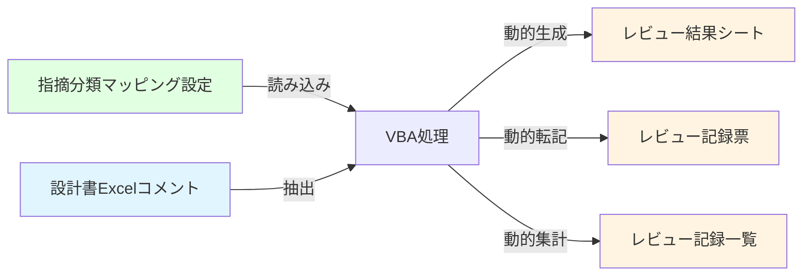
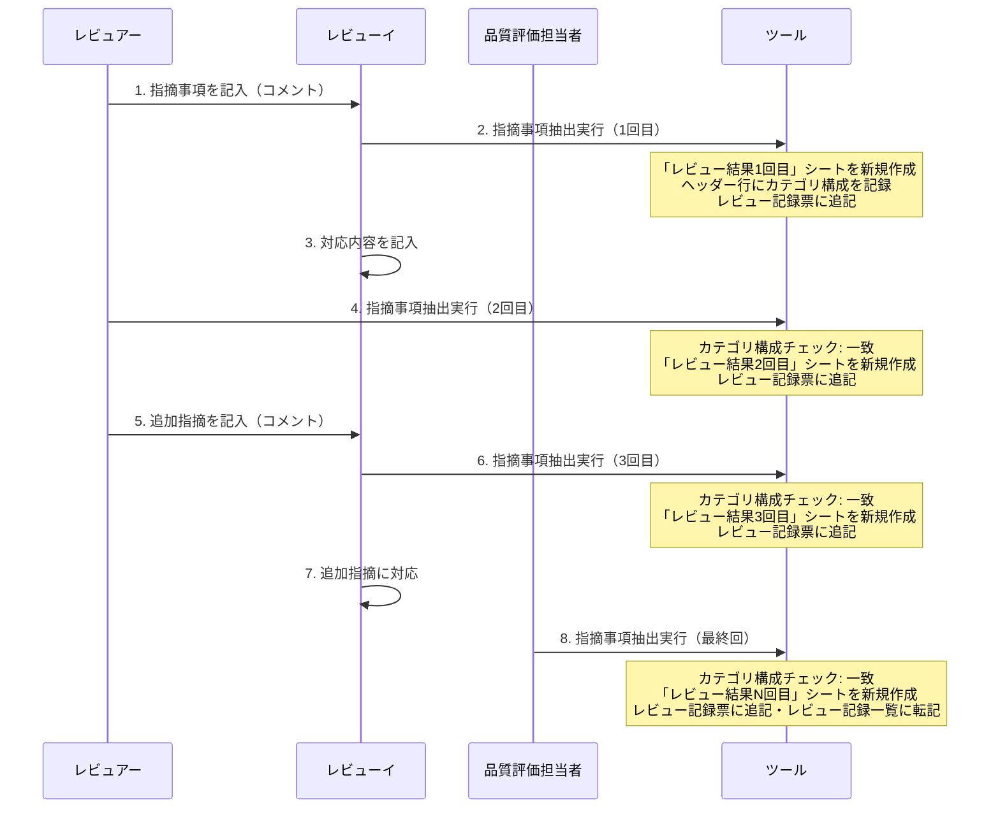
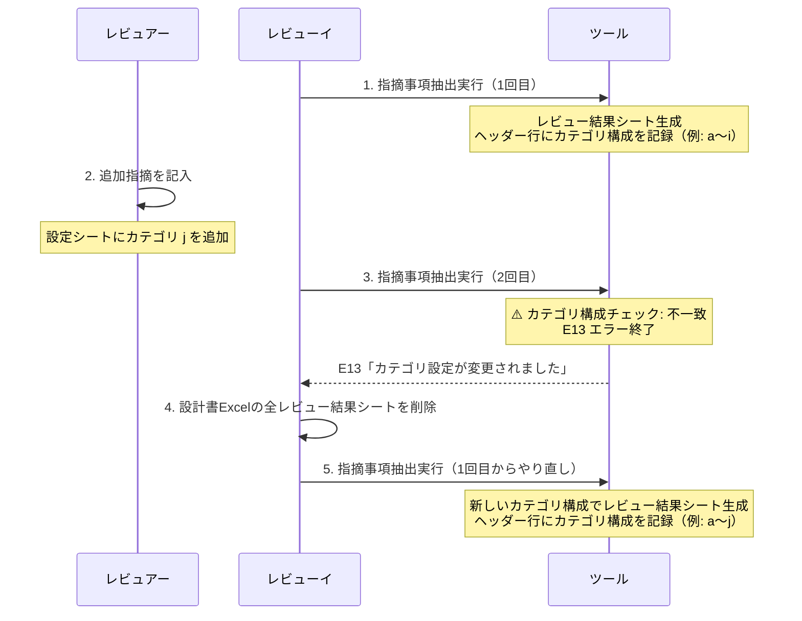

# v2.0 改修計画：動的カテゴリ対応

> このドキュメントは **未実装の改修計画**（Phase3以降）をまとめたものです。
> 現行仕様の設計書は各 `01-05` ドキュメントを参照してください。

---

## 改修概要

### 改修の背景

現行ツールは 9 種類の指摘分類（a～i）しか対応していないが、VeiiNus「原因分類」（27 種類）に対応するため、30 種類程度まで拡張する必要がある。

### 改修の目的

1. **指摘分類を9種類から30種類程度に拡張**
   - 現行の 9 種類（a～i）に加え、21 種類（j～z、aa～ad）を追加
   - 将来的には最大 676 種類（a～zz）まで対応可能な設計

2. **カテゴリ数を固定値からハードコードから設定シート管理に変更**
   - 指摘分類マッピング設定シートで管理
   - コード修正不要でカテゴリの追加・削除が可能

3. **将来的なカテゴリ追加に柔軟に対応できる設計**
   - 動的生成方式による拡張性の確保
   - エイリアス体系により最大 676 種類まで対応可能

### 改修方式

**動的生成方式**:

- 設定シート「指摘分類マッピング設定」からカテゴリを読み込み
- 必要な列数だけ動的に生成
- カテゴリ追加時はコード修正不要（設定シートのみ更新）

**段階的実装アプローチ**:

```
Phase 0: 設計書修正（0.5日）
  ↓ （実装の方向性を明確化）
Phase 1: 転記ループ化（固定長a～i）（0.5日） ✅ 実装済み
  ↓ （ループが正しく動作することを確認）
Phase 2: 可変長対応（1-2文字）（1.7日） ✅ 実装済み
  ↓ （カテゴリ抽出の拡張性を確保）
Phase 3: 動的列生成（1.3日）  ← 未実装（以下計画）
  ↓ （カテゴリ数を可変にする）
Phase 4: 設定シート拡張（0.3日）  ← 未実装（以下計画）
  ↓ （30種類のサンプルカテゴリを設定）
```

#### Phase 3 進捗チェックリスト

- [ ] `Module1.bas`: `LoadCategoriesFromSettings` 関数の実装（設定シートからカテゴリリストを取得）
- [ ] `Module1.bas`: `SortDictionaryKeys` 関数の実装（バブルソートでキーを昇順ソート）
- [ ] `Sheet1.cls`: カテゴリ列定数（`COL_CATEGORY_a` ～ `COL_CATEGORY_i` 等）の削除と動的計算への置き換え
- [ ] `Sheet1.cls`: レビュー結果シート生成時にカテゴリ名をヘッダー行（`ROW_CATEGORY - 1` 行）へ書き込む処理の追加
- [ ] `Sheet1.cls`: レビュー記録一覧への初回書き込み時にカテゴリ名をヘッダー行（1行目）へ書き込む処理の追加
- [ ] `Sheet1.cls`: レビュー結果シート生成時のカテゴリ構成チェック（E13）の実装
- [ ] `Sheet1.cls`: レビュー記録一覧転記時のカテゴリ構成チェック（E13）の実装
- [ ] `Sheet1.cls`: 設定シートが空の場合のエラー処理（E12）の実装
- [ ] `Module2.bas`: `DelAllReviewComments_Click_Core` へのカテゴリ動的読み込み対応
- [ ] `Module2.bas`: `DelAllReviewResultSheets_Click_Core` へのカテゴリ動的読み込み対応
- [ ] 自動テスト（scenario12/13）の作成と動作確認

#### Phase 4 進捗チェックリスト

- [ ] 指摘分類マッピング設定シートに拡張カテゴリ（j～z: 17種類、aa～ad: 4種類）のサンプルデータを追加
- [ ] xlsmファイルをビルド（`vba-text-based-dev` の `build` を実行）
- [ ] Excelで動作確認（30カテゴリ設定での抽出処理が正常動作すること）
- [ ] `docs/01-overview.md` のカテゴリ数（現在9種類）を30種類に更新

### 改修後のデータフロー



**変更点**:

- 🆕 **設定シートからの読み込み**: カテゴリリストを動的に取得
- 🔄 **動的生成**: カテゴリ数に応じて列数を自動調整
- 🔄 **動的転記**: 固定 9 列から可変 N 列に変更
- 🔄 **動的集計**: カテゴリ数に応じた集計処理

---

## 運用フローとエラーハンドリング設計

### 正常フロー（カテゴリ変更なし）



### カテゴリ変更エラー発生時のフロー



---

## 設計原則

カテゴリ増減時の動作について、以下の設計原則を採用する：

**原則1: カテゴリ数の固定（設計書Excel全体）**

- 設計書 Excel の初回レビュー実行時にカテゴリ数を固定
- レビュー結果シート、レビュー記録一覧の両方で同じカテゴリ数を使用
- カテゴリ数が変更された場合はエラー終了
- やり直しを促すことでデータ整合性を保証

**原則2: シンプルな実装**

- 動的拡張・列シフトなどの複雑な処理を避ける
- カテゴリリスト（順序付き）の比較のみで判定（数・順序・内容の変更を一括検出）

**原則3: ユーザーへの明確な通知**

- カテゴリ変更が発生した場合はエラーメッセージを表示
- やり直し方法を明示（設計書 Excel 全体のやり直し）

**原則4: 品質評価の観点を重視**

- 複数のレビュー結果シートを横並びで比較・集計できるようにする
- カテゴリ数が異なるレビュー結果シートが混在すると集計不可
- 設計書 Excel 全体で一貫したカテゴリ構造を維持

---

## ケース1: カテゴリ数変更時の動作（増加・削除）

**状況**:

- 1 回目: カテゴリ a～i（9 種類）でレビュー結果シート「レビュー結果 1 回目」生成
- 設定シートのカテゴリを変更（例: j を追加して 10 種類、または i を削除して 8 種類）
- 2 回目: カテゴリ数が変更された状態で実行

**問題**:

- 既存のレビュー結果シート「レビュー結果 1 回目」は 9 列で作成済み
- レビュー記録一覧も 9 列で作成済み
- カテゴリ数が変更されると列構造が不整合
- 品質評価時に複数のレビュー結果シートを横並びで集計できない

**設計方針（原則1, 2, 4に基づく）**:

1. **カテゴリ名の書き込み（2箇所）**:

   **A. レビュー結果シート**:
   - レビュー結果シート生成時に、カテゴリ列のヘッダー行にエイリアスを書き込む
   - 書き込み位置: `ROW_CATEGORY - 1` 行（9 行目）、`COL_CATEGORY_START` 列（B 列）から順番に
   - 書き込み内容: 各カテゴリのエイリアス（例: a, b, c, ...）
   - この行を走査することで、後から「何カテゴリで作られたシートか」を確実に判定できる

   **B. レビュー記録一覧**:
   - レビュー記録一覧の初回作成時に、カテゴリ列のヘッダー行にエイリアスを書き込む
   - 書き込み位置: 1 行目、`DETAIL_COL_LIST_CATEGORY_START` 列（AC 列 = 29 列目）から順番に
   - 書き込み内容: 各カテゴリのエイリアス（例: a, b, c, ...）
   - この行を走査することで、後から「何カテゴリで作成された一覧か」を確実に判定できる

   > **設計方針の背景**:
   > AA2 セルや AA1 セルに「カテゴリ数（数値）」を記録する方式は、そのセルが人手で変更・消去された場合に誤った判定につながる。代わりに「カテゴリ列のヘッダー自体」をデータとして使用することで、実際のシート構造と判定根拠が常に一致し、改ざんの影響を受けにくくなる。

2. **カテゴリリストの比較（2箇所）**:

   **A. レビュー結果シート生成時**:
   - 既存のレビュー結果シートが存在する場合、そのカテゴリリスト（順序付き）と現在のカテゴリリストを比較
   - 既存シートのカテゴリリストは、ヘッダー行（`ROW_CATEGORY - 1` 行 = 9 行目）を `COL_CATEGORY_START` 列から走査して取得
   - カテゴリリストが異なる場合（数変更・順序変更・内容変更を含む）は**エラー終了**

   **B. レビュー記録一覧への転記時**:
   - レビュー記録一覧が既に存在する場合、そのカテゴリリスト（順序付き）と現在のカテゴリリストを比較
   - レビュー記録一覧のカテゴリリストは、ヘッダー行（1 行目）の `DETAIL_COL_LIST_CATEGORY_START` 列から走査して取得
   - カテゴリリストが異なる場合は**エラー終了**

3. **エラーメッセージ（原則3に基づく）**:

   ```
   カテゴリ設定が変更されました（{前回}種類 → {今回}種類）。

   既存のレビュー結果シートのカテゴリ構造と不整合になるため、処理を中断します。

   【対処方法】
   1. 設計書Excelの既存のレビュー結果シート（全て）を削除
   2. 1回目のレビューから実行をやり直す
   ```

4. **ユーザーアクション**:
   - 設計書 Excel の既存のレビュー結果シート（「レビュー結果 1 回目」「レビュー結果 2 回目」など）を全て削除
   - 1 回目のレビューから実行をやり直す（レビュー記録一覧の削除は不要）

**実装詳細**:

1. **レビュー結果シートへのカテゴリ名書き込み**:

   ```vba
   ' レビュー結果シート生成時にカテゴリ列のヘッダー行にエイリアスを書き込む
   Dim i As Long
   For i = 0 To categoryList.Count - 1
       output.Cells(ROW_CATEGORY - 1, COL_CATEGORY_START + i).Value = categoryList(i)
   Next i
   ' ※ ROW_CATEGORY - 1 = 9行目、COL_CATEGORY_START = 2（B列）から順に a, b, c, ... が書き込まれる
   ```

2. **レビュー結果シート生成時のカテゴリリストチェック**:

   ```vba
   ' 既存のレビュー結果シートからカテゴリリスト（順序付き）をヘッダー行の走査で取得
   Dim existingResultSheet As Worksheet
   Dim existingCategoryList As String

   ' 既存のレビュー結果シートを探す
   For Each existingResultSheet In book.Worksheets
       If existingResultSheet.Name Like "レビュー結果*回目" Then
           ' カテゴリヘッダー行（ROW_CATEGORY - 1 行）を COL_CATEGORY_START 列から走査
           existingCategoryList = ""
           Dim col As Long
           For col = COL_CATEGORY_START To COL_CATEGORY_START + 1000
               If existingResultSheet.Cells(ROW_CATEGORY - 1, col).Value = "" Then Exit For
               existingCategoryList = existingCategoryList & existingResultSheet.Cells(ROW_CATEGORY - 1, col).Value & ","
           Next col
           Exit For
       End If
   Next existingResultSheet

   ' 現在のカテゴリリストを構築
   Dim currentCategoryList As String
   currentCategoryList = ""
   For i = 0 To categoryList.Count - 1
       currentCategoryList = currentCategoryList & categoryList(i) & ","
   Next i

   ' カテゴリリストをチェック（カテゴリ数・順序・内容を一括検出）
   If Len(existingCategoryList) > 0 And existingCategoryList <> currentCategoryList Then
       MsgBox "カテゴリ設定が変更されました。" & vbCrLf & _
              vbCrLf & _
              "既存のレビュー結果シートのカテゴリ構造と不整合になるため、処理を中断します。" & vbCrLf & _
              vbCrLf & _
              "【対処方法】" & vbCrLf & _
              "1. 設計書Excelの既存のレビュー結果シート（全て）を削除" & vbCrLf & _
              "2. 1回目のレビューから実行をやり直す", vbExclamation
       Application.ScreenUpdating = True
       Application.Cursor = xlDefault
       Exit Sub
   End If
   ```

3. **レビュー記録一覧へのカテゴリ名書き込み**:

   ```vba
   ' 初回実行時にカテゴリ列のヘッダー行にエイリアスを書き込む
   If reviewListSheet.Cells(1, DETAIL_COL_LIST_CATEGORY_START).Value = "" Then
       For i = 0 To categoryList.Count - 1
           reviewListSheet.Cells(1, DETAIL_COL_LIST_CATEGORY_START + i).Value = categoryList(i)
       Next i
   End If
   ' ※ DETAIL_COL_LIST_CATEGORY_START = 29（AC列）から順に a, b, c, ... が書き込まれる
   ```

4. **レビュー記録一覧転記時のカテゴリリストチェック**:

   ```vba
   ' 2回目以降の実行時にカテゴリリスト（順序付き）をヘッダー行の走査で取得してチェック
   Dim existingListCategoryList As String
   existingListCategoryList = ""
   For col = DETAIL_COL_LIST_CATEGORY_START To DETAIL_COL_LIST_CATEGORY_START + 1000
       If reviewListSheet.Cells(1, col).Value = "" Then Exit For
       existingListCategoryList = existingListCategoryList & reviewListSheet.Cells(1, col).Value & ","
   Next col

   If Len(existingListCategoryList) > 0 And existingListCategoryList <> currentCategoryList Then
       MsgBox "カテゴリ設定が変更されました。" & vbCrLf & _
              vbCrLf & _
              "レビュー記録一覧のカテゴリ構造が不整合になるため、処理を中断します。" & vbCrLf & _
              vbCrLf & _
              "【対処方法】" & vbCrLf & _
              "1. 設計書Excelの既存のレビュー結果シート（全て）を削除" & vbCrLf & _
              "2. 1回目のレビューから実行をやり直す", vbExclamation
       Application.ScreenUpdating = True
       Application.Cursor = xlDefault
       Exit Sub
   End If
   ```

5. **Dictionary型でのカテゴリ管理**:

   ```vba
   ' カテゴリマッピング（エイリアス → 列番号）
   Dim categoryColumnMap As Object
   Set categoryColumnMap = CreateObject("Scripting.Dictionary")

   ' マッピングを作成
   For i = 0 To categoryList.Count - 1
       categoryColumnMap.Add categoryList(i), DETAIL_COL_LIST_CATEGORY_START + i
   Next i

   ' 集計時にエイリアスから列番号を取得
   If categoryColumnMap.Exists(category) Then
       colNum = categoryColumnMap(category)
       listSheet.Cells(listRow, colNum).Value = count
   End If
   ```

**影響範囲**:

- レビュー結果シート生成時に、カテゴリ列ヘッダー行（`ROW_CATEGORY - 1` 行 = 9 行目）にエイリアスを書き込む処理を追加
- レビュー記録一覧の初回作成時に、カテゴリ列ヘッダー行（1 行目、`DETAIL_COL_LIST_CATEGORY_START` 列から）にエイリアスを書き込む処理を追加
- レビュー結果シート生成時に、ヘッダー行走査によるカテゴリ数チェック処理を追加
- レビュー記録一覧転記時に、ヘッダー行走査によるカテゴリ数チェック処理を追加
- カテゴリ数が異なる場合はエラー終了（列シフトなどの複雑な処理は不要）
- AA2 セル・AA1 セルへのカテゴリ数記録は**不要**（ヘッダー行を使用するため）

---

## ケース2: カテゴリ順序変更時の動作

**状況**:

- 1 回目: カテゴリ a, b, c（表示順 1, 2, 3）でレビュー結果シート生成
- 表示順を 3, 1, 2 に変更（c, a, b の順序）
- 2 回目: 実行

**問題**:

- 既存のレビュー結果シートと列順序が異なるシートが生成される
- 品質評価時に複数のレビュー結果シートを横並びで比較する際、列位置が揃っていないと比較が困難
- レビュー記録一覧の列順序も初回生成時から変わってしまう

**設計方針（原則1, 4に基づく）**:

1. **エラー終了**:
   - カテゴリ順序の変更は「カテゴリ設定の変更」と見なしてエラー終了
   - 既存のレビュー結果シートのカテゴリリスト（順序付き）と現在の設定を比較して不一致ならエラー
   - ケース1（カテゴリ数変更）と同じ E13 メッセージを表示

2. **チェック方法**:
   - ヘッダー行のエイリアスリストを順序込みで文字列連結して比較（例: `"a,b,c"` vs `"c,a,b"`）
   - 順序が変わった場合も不一致として検出できる

3. **ユーザーアクション**:
   - 設計書 Excel の既存のレビュー結果シート（全て）を削除
   - 1 回目のレビューから実行をやり直す（レビュー記録一覧の削除は不要）

**実装詳細（チェック方法の変更）**:

```vba
' カテゴリ数だけでなくリスト全体（順序付き）を比較する
Dim existingCategoryList As String
existingCategoryList = ""
For col = COL_CATEGORY_START To COL_CATEGORY_START + 1000
    If existingResultSheet.Cells(ROW_CATEGORY - 1, col).Value = "" Then Exit For
    existingCategoryList = existingCategoryList & existingResultSheet.Cells(ROW_CATEGORY - 1, col).Value & ","
Next col

Dim currentCategoryList As String
currentCategoryList = ""
For i = 0 To categoryList.Count - 1
    currentCategoryList = currentCategoryList & categoryList(i) & ","
Next i

' リストが一致しなければエラー（カテゴリ数変更・順序変更・内容変更を全て検出）
If Len(existingCategoryList) > 0 And existingCategoryList <> currentCategoryList Then
    MsgBox "カテゴリ設定が変更されました。" & vbCrLf & _
           vbCrLf & _
           "既存のレビュー結果シートのカテゴリ構造と不整合になるため、処理を中断します。" & vbCrLf & _
           vbCrLf & _
           "【対処方法】" & vbCrLf & _
           "1. 設計書Excelの既存のレビュー結果シート（全て）を削除" & vbCrLf & _
           "2. 1回目のレビューから実行をやり直す", vbExclamation
    Application.ScreenUpdating = True
    Application.Cursor = xlDefault
    Exit Sub
End If
```

> **補足**: この変更により、ケース1（カテゴリ数変更）とケース2（順序変更）は同じチェックロジックで検出できる。「カテゴリ数だけ比較」から「カテゴリリスト全体を比較」に変更することで、カテゴリの順序変更・内容変更・追加・削除を全てカバーできる。

---

## 新規エラーハンドリング（v2.0で追加）

### カテゴリ設定変更エラー（E13）

**検出条件**:

- **レビュー結果シート生成時**: 既存のレビュー結果シートのカテゴリヘッダー行（`ROW_CATEGORY - 1` 行）から走査して得たカテゴリリスト（順序付き）と、現在の設定シートのカテゴリリストが異なる（数変更・順序変更・内容変更を全て含む）
- **レビュー記録一覧転記時**: レビュー記録一覧のヘッダー行（1 行目）を `DETAIL_COL_LIST_CATEGORY_START` 列から走査して得たカテゴリリスト（順序付き）と、現在の設定シートのカテゴリリストが異なる

**エラー処理**:

1. **エラーメッセージ表示**（E13）:

   ```
   カテゴリ設定が変更されました（{前回}種類 → {今回}種類）。

   既存のレビュー結果シートのカテゴリ構造と不整合になるため、処理を中断します。

   【対処方法】
   1. 設計書Excelの既存のレビュー結果シート（全て）を削除
   2. 1回目のレビューから実行をやり直す
   ```

2. **処理を中断**:
   - `Application.ScreenUpdating = True`
   - `Application.Cursor = xlDefault`
   - `Exit Sub`

3. **ユーザーアクション**:
   - 設計書 Excel の既存のレビュー結果シート（「レビュー結果 1 回目」「レビュー結果 2 回目」など）を全て削除
   - 1 回目のレビューから実行をやり直す（レビュー記録一覧の削除は不要）

### カテゴリ設定シート空エラー（E12）

**検出条件**:

- 指摘分類マッピング設定シートにデータが 1 件も登録されていない

**エラー処理**:

- メッセージボックス表示：「指摘分類マッピング設定シートにカテゴリが登録されていません。」
- 処理を中断

### v2.0追加メッセージ

#### エラー・処理中断

| コード | メッセージ | 表示タイミング | 処理への影響 |
|--------|-----------|-------------|------------|
| E12 | 指摘分類マッピング設定シートにカテゴリが登録されていません。 | 設定シートにカテゴリが 1 件もない | 処理中断 |
| E13 | カテゴリ設定が変更されました。（詳細メッセージは E13 参照） | 既存レビュー結果シートまたはレビュー記録一覧とカテゴリ構成が不一致 | 処理中断 |

---

## テストケース（v2.0）

> テストシナリオは以下の確認観点を網羅するよう設計されている。

| 観点 | 説明 | 対応シナリオ |
|------|------|------------|
| A | 初回実行でカテゴリリストがヘッダー行に正しく記録される | 1 |
| B | 2回目以降でカテゴリ一致時はエラーなく正常続行する | 1 |
| C | カテゴリ変更（追加または削除）でE13が発火し処理中断する | 2 |
| D | カテゴリ順序変更（数は同じ）でもE13が発火する | 3 |
| E | E13後、結果シート削除→再実行で正常復帰する | 2 |
| F | やり直し時、レビュー記録一覧は削除不要（同一行が上書きされる） | 2 |
| G | 同回数再実行時、確認ダイアログなしで結果シート・記録票行・記録一覧行が自動上書きされる | 4 |
| H | 未登録カテゴリ使用時はエラーシートに記録して処理続行する | 5 |
| I | 設定シートが空の場合はE12で処理中断する | 5 |

### シナリオ1: 初回実行〜複数回正常実行（観点A・B）

| ステップ | 操作 | 期待結果 |
|---------|------|---------|
| 1 | カテゴリ a, b, c（3種類）で設定 | - |
| 2 | レビュー回数=1で実行 | 「レビュー結果1回目」シート生成<br>ヘッダー行（9行目 B〜D列）に a,b,c が書き込まれる（観点A）<br>レビュー記録一覧ヘッダー行（1行目 AC〜AE列）に a,b,c が書き込まれる（観点A） |
| 3 | レビュー回数=2で実行 | カテゴリリストチェック通過（エラーなし）（観点B）<br>「レビュー結果2回目」シート生成 |

### シナリオ2: カテゴリ変更検出 → やり直しフロー（観点C・E・F）

| ステップ | 操作 | 期待結果 |
|---------|------|---------|
| 1 | カテゴリ a, b, c（3種類）で設定 | - |
| 2 | レビュー回数=1で実行 | 「レビュー結果1回目」シート生成、ヘッダー行に a,b,c 書き込み |
| 3 | 設定シートにカテゴリ d を追加（4種類に変更） | - |
| 4 | レビュー回数=2で実行 | E13 表示・処理中断（観点C） |
| 5 | 「レビュー結果1回目」シートを削除 | - |
| 6 | レビュー回数=1で実行 | 「レビュー結果1回目」シート生成（4列）、ヘッダー行に a,b,c,d 書き込み（観点E）<br>レビュー記録一覧の1回目行が上書き更新される（観点F） |
| 7 | レビュー回数=2で実行 | 「レビュー結果2回目」シート生成（4列）、エラーなし（観点E） |

### シナリオ3: カテゴリ順序変更の検出（観点D）

| ステップ | 操作 | 期待結果 |
|---------|------|---------|
| 1 | カテゴリ a, b, c（表示順 1, 2, 3）で設定 | - |
| 2 | レビュー回数=1で実行 | 「レビュー結果1回目」シート生成、ヘッダー行に a,b,c の順で書き込まれる |
| 3 | 表示順を 3, 1, 2 に変更（c, a, b の順序） | - |
| 4 | レビュー回数=2で実行 | E13 表示・処理中断（観点D）<br>カテゴリリスト "a,b,c," と "c,a,b," の不一致で検出 |

### シナリオ4: 重複実行（観点G）

| ステップ | 操作 | 期待結果 |
|---------|------|---------|
| 1 | カテゴリ a, b, c で設定し、レビュー回数=1で実行 | 「レビュー結果1回目」シート生成 |
| 2 | 再度レビュー回数=1で実行 | 上書き確認ダイアログは表示されない。既存シートが削除されて新規生成される。記録票の同回数行・記録一覧の同回数行も自動上書き更新される（観点G） |

### シナリオ5: 入力エラー処理（観点H・I）

| ステップ | 操作 | 期待結果 |
|---------|------|---------|
| 1 | カテゴリ a, b, c で設定し、コメントに未登録カテゴリ z を使用して実行 | 処理は続行し、エラーシートに「未登録のカテゴリが使用されています: z」が記録される（観点H） |
| 2 | 設定シートのカテゴリをすべて削除して実行 | E12 表示・処理中断（観点I） |

---

## 改修内容の詳細

### 新規追加関数

| 関数名 | 配置 | 説明 | Phase |
|-------|------|------|-------|
| `ExtractCategory` | Module1.bas | カテゴリ抽出（1-2文字対応） | Phase 2 ✅ |
| `IsValidCategory` | Module1.bas | カテゴリ妥当性チェック | Phase 2 ✅ |
| `LoadCategoriesFromSettings` | Module1.bas | 設定シートからカテゴリリスト取得 | Phase 3 |
| `SortDictionaryKeys` | Module1.bas | Dictionary のキーソート | Phase 3 |

#### LoadCategoriesFromSettings関数

**機能**:「指摘分類マッピング設定」シートからカテゴリ一覧を取得

**引数**: なし

**戻値**:

- (Variant): カテゴリの Variant 配列（1-indexed）

**処理フロー**:

1. 設定シートから A 列（エイリアス）と C 列（表示順）を読み込み
2. 表示順でソート
3. 配列に変換して返す

#### SortDictionaryKeys関数

**機能**: Dictionary のキー（数値）を昇順ソート

**引数**:

- `dict` (Object): Dictionary オブジェクト

**戻値**:

- (Variant): ソート済みキーの配列（0-indexed）

**処理フロー**:

- バブルソートでキーを昇順ソート

### 修正箇所一覧

| # | ファイル | 行番号 | 内容 | Phase |
|---|---------|--------|------|-------|
| 1 | Sheet1.cls | 594 | カテゴリ抽出を関数呼出しに変更 | Phase 2 ✅ |
| 2 | Sheet1.cls | 708 | カテゴリ判定を関数呼出しに変更 | Phase 2 ✅ |
| 3 | Sheet1.cls | 995-1003 | 転記処理のループ化 | Phase 1 ✅ |
| 4 | Sheet1.cls | 定数定義 | カテゴリ列定数を削除 | Phase 3 |
| 5 | Module2.bas | 1305 | カテゴリ抽出を関数呼出しに変更 | Phase 2 ✅ |
| 6 | Module2.bas | 1308 | カテゴリ判定を関数呼出しに変更 | Phase 2 ✅ |

### 指摘分類マッピング設定の拡張

#### 拡張後のフォーマット

| A列: エイリアス | B列: 分類名 | C列: 表示順 |
|---------------|-----------|-----------|
| a | 01_要件漏れ | 1 |
| b | 02_要件誤り | 2 |
| ... | ... | ... |
| i | 93_仕様変更 | 9 |
| j | （新規）VeiiNus原因分類1 | 10 |
| ... | ... | ... |
| z | （新規）VeiiNus原因分類17 | 26 |
| aa | （新規）VeiiNus原因分類18 | 27 |
| ab | （新規）VeiiNus原因分類19 | 28 |
| ac | （新規）VeiiNus原因分類20 | 29 |
| ad | （新規）VeiiNus原因分類21 | 30 |

#### エイリアス体系

| 範囲 | エイリアス | 個数 | 用途 |
|-----|-----------|------|------|
| 1-9 | a-i | 9 | 既存カテゴリ |
| 10-26 | j-z | 17 | 拡張カテゴリ（1文字） |
| 27-52 | aa-az | 26 | 拡張カテゴリ（2文字） |
| 53-78 | ba-bz | 26 | 将来の拡張用 |
| ... | ... | ... | 最大676個まで対応可能 |

#### 変更前後の比較

| 項目 | 変更前 | 変更後 |
|------|-------|-------|
| カテゴリ数 | 9個（a～i）固定 | 任意（最大676個） |
| エイリアス長 | 1文字固定 | 1-2文字可変 |
| カテゴリ追加方法 | VBAコード修正 | 設定シートのみ更新 |
| 列数 | 9列固定 | 動的生成 |
| 拡張性 | 低い | 高い |

### 改修のメリット

1. **保守性の向上**
   - カテゴリ追加時に VBA コード修正不要
   - 設定シートのみで管理できる

2. **拡張性の確保**
   - 将来的に最大 676 種類まで対応可能
   - エイリアス体系により体系的な管理が可能

3. **既存データとの互換性**
   - 既存の 9 種類（a～i）はそのまま利用可能
   - レビュー記録一覧の既存データに影響なし
