# テスト観点一覧

`Excel設計書レビュー指摘事項抽出ツール.xlsm` のテスト観点一覧。

各観点に対応するシナリオは [TEST_SCENARIOS.md](TEST_SCENARIOS.md) を参照。

---

## コメント解析（指摘抽出・カテゴリ判定）

設計書のExcelコメントを走査し、日時情報・指摘内容・カテゴリ・対応状況を正しく解析する機能の検証。

| ID | 観点 | 対応シナリオ |
|----|------|------------|
| 01 | 日時コメント（`*`）が正しく解析される（実施日・開始・終了・レビュー時間） | S01, S03 |
| 02 | 指摘コメントが正しく解析される（指摘者・カテゴリ・指摘内容） | S01, S02 |
| 03 | 結果シートの指摘詳細（E列）には `---` 区切りを含む全量が書き込まれる | S01, S02 |
| 04 | 記録票の指摘一覧では `---` で分割され、H列（指摘項目・問題点）と J列（処置・対策）に分かれて書き込まれる | S01, S02 |
| 05 | 末尾「済」で対応済みフラグが設定される | S01, S02 |
| 06 | 形式不正コメント（コロンなし・改行なし）がスキップされる | S02 |
| 07 | カテゴリなしコメント（`名前:` のみ）がスキップされる | S01 |
| 08 | 複数の `*` コメントで最後に走査されたものが採用される | S03 |
| 48 | 未登録カテゴリのコメントがエラーシートに記録され、他の有効コメントの処理が続行される | S24 |

---

## 結果シート生成

レビュー結果シートの生成・ヘッダー書込・カテゴリ行・集計行・指摘詳細の検証。

| ID | 観点 | 対応シナリオ |
|----|------|------------|
| 09 | 初回実行でレビュー結果シートが生成される | S01, S04 |
| 10 | ヘッダー部が正しく書き込まれる（ファイル名・レビュー回数・実施日時） | S01 |
| 11 | カテゴリエイリアス行（7 行目）にカテゴリエイリアス（a, b, c, ...）が書き込まれる | S01 |
| 12 | カテゴリ名行（8 行目）に指摘分類名（01_要件漏れ等）が書き込まれる | S01 |
| 13 | 対応済件数（9 行目）がカテゴリ別に正しく集計される | S01 |
| 14 | 未済件数（10 行目）がカテゴリ別に正しく集計される | S01 |
| 15 | 指摘詳細が正しく書き込まれる（シート・場所・指摘者・種別・内容・対応状況） | S01 |

---

## 記録票転記（レビュー記録票・サマリ）

レビュー記録票およびレビュー記録サマリ（レビュー記録一覧）への転記の検証。

| ID | 観点 | 対応シナリオ |
|----|------|------------|
| 16 | ヘッダー情報がレビュー記録票に正しく転記される | S01 |
| 17 | 指摘一覧がレビュー記録票に正しく転記される | S01 |
| 18 | レビュー記録票が開いていない場合にその設計書がスキップされる | S09 |
| 29 | レビュー記録サマリ使用時、レビュー回数・日付・開始/終了時刻・レビュー時間等がレビュー記録一覧に正しく転記される | S12 |

---

## ファイルフィルタリング

処理対象パターン・処理対象外パターンによるファイル選択の検証。

| ID | 観点 | 対応シナリオ |
|----|------|------------|
| 19 | 処理対象パターンにマッチするファイルが処理される | S01 |
| 20 | 処理対象外パターンにマッチするファイルが除外される | S01 |

---

## ダイアログ・確認・通知

抽出前確認・削除確認・完了通知・中止通知の各ダイアログ動作の検証。

| ID | 観点 | 対応シナリオ |
|----|------|------------|
| 21 | 抽出前確認「いいえ」でそのファイルをスキップ | S05 |
| 22 | 抽出前確認「キャンセル」で以降の全ファイルをスキップ | S06 |
| 30 | 抽出前確認「はい」選択で処理が続行され完了通知が表示される（C02→I01） | S01〜S04, S07〜S10, S12, S21〜S30, S32, S33 |
| 31 | 抽出前確認「キャンセル」後に「以降の処理を中止します」通知（C03）が表示される | S06 |
| 32 | メモ削除確認「はい」選択（C04）でメモが削除され完了通知（I02）が表示される | S10 |
| 33 | シート削除確認「はい」選択（C05）でシートが削除され完了通知（I03）が表示される | S10 |
| 34 | 抽出処理完了時に I01（処理ファイル数を含む）通知が表示される | S01〜S04, S07〜S10, S12, S21〜S30, S32, S33 |
| 35 | メモ削除完了時に I02 通知が表示される | S10 |
| 36 | レビュー結果シート削除完了時に I03 通知が表示される | S10 |

---

## 連続実行・重複実行

2回目以降の抽出実行および同回数での再実行（上書き）の検証。

| ID | 観点 | 対応シナリオ |
|----|------|------------|
| 23 | 2 回目以降でエラーなく続行し新規シートが生成される | S04 |
| 24 | 同回数再実行時、確認ダイアログなしで既存の結果シート・記録票行が自動的に上書きされる | S07 |

---

## 削除機能

コメント削除・レビュー結果シート削除の各ボタン動作の検証。

| ID | 観点 | 対応シナリオ |
|----|------|------------|
| 26 | コメント削除ボタンで全レビューコメントが削除される | S10 |
| 27 | レビュー結果シート削除ボタンで全レビュー結果シートが削除される | S10 |
| 28 | 削除対象なしで通知メッセージが表示される（E09/E10） | S11 |

---

## エラー処理

コメント解析中のエラー検出・エラーシート記録・処理続行の検証。

| ID | 観点 | 対応シナリオ |
|----|------|------------|
| 25 | 日時コメント不正（要素不足）でエラーシートに記録・処理続行 | S08 |

---

## 設定バリデーション

実行前の設定値チェック・エラー検出・処理中断の検証。

### ファイルパス・シート名チェック

| ID | 観点 | 対応シナリオ |
|----|------|------------|
| 37 | レビュー記録サマリ使用時にファイルパス未入力（E01）でエラーになり処理中断する | S13 |
| 38 | 工程・レビュア・レビュイの反映値が未入力（E02）でエラーになり処理中断する | S14 |
| 39 | レビュー記録サマリ使用時にシート名未入力（E03）でエラーになり処理中断する | S15 |
| 40 | レビュー記録一覧ファイルが存在しない場合（E04）でエラーになり処理中断する | S16 |
| 41 | レビュー記録一覧ファイルに指定シートが存在しない場合（E05）でエラーになり処理中断する | S17 |
| 42 | レビュー記録票に転記先シートが存在しない場合（E06）でエラーになり処理中断する | S18 |

### レビュー回数・対象文書チェック

| ID | 観点 | 対応シナリオ |
|----|------|------------|
| 43 | レビュー回数順序不正（前回分のシートが存在しない）の場合（E07）でエラーになり処理中断する | S19 |
| 44 | 対象パターンにマッチする設計書が開いていない場合（E08）で通知して処理中断する | S20 |

### カテゴリ設定チェック

| ID | 観点 | 対応シナリオ |
|----|------|------------|
| 67 | 2回目以降の抽出でカテゴリが変更されている場合、E13 エラーで処理が中断される | S31 |
| 72 | カテゴリが1件も登録されていない場合（E12）でエラーになり処理中断する | S34 |

### エイリアスバリデーション

指摘分類マッピング設定シートのエイリアスに不正な値（重複・形式不正）が含まれる場合のエラー検出を検証する。
エイリアスは英小文字1〜2文字（正規表現: `^[a-z]{1,2}$`）のみ使用可能。

| ID | 観点 | 対応シナリオ |
|----|------|------------|
| 78 | エイリアスに重複がある場合 E14 エラーが発生し処理が中断される | S38 |
| 79 | エイリアスの形式が不正（英小文字1-2文字以外）の場合 E15 エラーが発生し処理が中断される | S39 |

---

## 項目取得警告

設計書から工程・レビュア・レビュイを取得できない場合の警告・代替値セット・処理続行の検証。

| ID | 観点 | 対応シナリオ |
|----|------|------------|
| 45 | 工程を設計書から取得できない場合（W02）に警告して「取得できませんでした」をセットし処理続行する | S21 |
| 46 | レビュアを設計書から取得できない場合（W03）に警告して「取得できませんでした」をセットし処理続行する | S22 |
| 47 | 作成者・レビュイを設計書から取得できない場合（W04）に警告して「取得できませんでした」をセットし処理続行する | S23 |

---

## カテゴリ動的調整

指摘分類マッピング設定のカテゴリ数に応じて、テンプレートシートおよびレビュー記録一覧の列構造を動的に調整する機能の検証。

### テンプレート構造の調整

テンプレートシートのカテゴリ列数は、設定されたカテゴリマッピング数に応じて実行時に動的に調整される。
デフォルトのテンプレートはカテゴリ9列で設計されており、増減時は行7〜11（ヘッダー行）への列挿入・削除で対応する。

> **ヘルパー列とは**: 行14〜16の対応状況 COUNTIF 数式列（SUMIF 列）の右端に位置する幅制御用の列。カテゴリ数変更に応じて列位置が移動し、その幅は変更前後で引き継がれる必要がある。

| ID | 観点 | 対応シナリオ |
|----|------|------------|
| 49 | カテゴリ数がデフォルト（9）より多い場合、行7〜11に必要な数の列が挿入される | S25 |
| 50 | カテゴリ数がデフォルト（9）より少ない場合、行7〜11から超過列が削除される | S26 |
| 51 | カテゴリ列調整後、カテゴリエイリアス行（7行目）・カテゴリ名行（8行目）が設定値と一致する | S24, S25, S26 |
| 52 | カテゴリ列調整後、計列（最終カテゴリの右隣）の列幅がデフォルト幅を維持する | S24, S25, S26 |
| 53 | カテゴリ列調整後、SUMIF列（対応状況 COUNTIF 列）の列幅が標準幅に統一される（旧ヘルパー列幅が残留しない） | S24, S25, S26 |
| 54 | カテゴリ列調整後、ヘルパー列の列幅が元のヘルパー列幅を引き継ぐ（列位置が変わっても幅が保持される） | S24, S25, S26 |

### 印刷範囲

| ID | 観点 | 対応シナリオ |
|----|------|------------|
| 55 | カテゴリ増後の印刷範囲右端が計列まで拡張される | S25 |
| 56 | カテゴリ減後の印刷範囲右端がK列（対応状況）を含む位置を最低保証する | S26 |

### 書式（背景色）

| ID | 観点 | 対応シナリオ |
|----|------|------------|
| 57 | カテゴリ増後、計列14行目の背景色がクリアされる（列Insert時の書式引き継ぎを除去） | S25 |
| 58 | カテゴリ減後、K列7〜11行目の背景色がクリアされる（列Delete時の書式引き継ぎを除去） | S26 |

### $K列（対応状況列）の保護

カテゴリ減→増の複合操作では、actualSumifStart の計算値がK列(11)以下になることがある。
この状態で行1〜16にInsertするとExcelが `$K15:$K16` を自動シフトして数式を破壊するため、
actualSumifStart はL列(12)以上にクランプされる。

| ID | 観点 | 対応シナリオ |
|----|------|------------|
| 59 | カテゴリ減→増の複合操作後、件数数式（B9等）の `$K15:$K16` 参照が保たれる | S27 |
| 60 | カテゴリ減→増の複合操作後、K14セル（対応状況ヘッダー）が保持される | S27 |
| 61 | カテゴリ減→増の複合操作後、罫線がL列以降にはみ出さない | S27 |

### 抽出結果の整合性

| ID | 観点 | 対応シナリオ |
|----|------|------------|
| 62 | カテゴリ増設定で抽出処理を実行した場合、全カテゴリの指摘が正しく集計される | S25 |
| 63 | デフォルト設定（9カテゴリ）で抽出処理を実行した場合、設定カテゴリの指摘が正しく集計される | S01〜S10, S12 |
| 64 | カテゴリ減→増後の抽出処理で指摘が正しく集計される（$K参照が保たれているため） | S27（第2ステップ） |

### レビュー記録サマリとの複合

| ID | 観点 | 対応シナリオ |
|----|------|------------|
| 65 | カテゴリ増設定でレビュー記録サマリ使用時、レビュー記録一覧のカテゴリヘッダーが正しく増設される | S29 |
| 66 | カテゴリ減設定でレビュー記録サマリ使用時、レビュー記録一覧のカテゴリヘッダーが設定数に削減される | S30 |

### 連続カテゴリ変更

同方向（増→さらに増、減→さらに減）への連続カテゴリ変更に対してテンプレート列調整が正しく動作することを検証する。

| ID | 観点 | 対応シナリオ |
|----|------|------------|
| 68 | 連続カテゴリ増（増→さらに増）後、テンプレート列数・列幅・印刷範囲が正しく調整される | S32 |
| 69 | 連続カテゴリ減（減→さらに減）後、テンプレート列数・列幅・印刷範囲が正しく調整される | S33 |
| 70 | 連続カテゴリ増後の抽出処理で、全カテゴリの指摘が正しく集計される | S32 |
| 71 | 連続カテゴリ減後の抽出処理で、設定カテゴリの指摘が正しく集計される | S33 |

---

## 大量カテゴリ対応

多数のカテゴリ（1文字 a-z + 2文字 aa-zz の全組み合わせ = 702件）を設定した場合のテンプレート動的調整と COM 安定性を検証する。

| ID | 観点 | 対応シナリオ |
|----|------|------------|
| 73 | カテゴリ数が702件（a-z + aa-zz全組み合わせ）の場合に全カテゴリのコメントが正しく抽出される | S35 |
| 74 | 大量カテゴリ時のテンプレート列調整（AdjustTemplateCategoryColumns 等）が DoEvents により COM ビジーエラーを起こさず完了する | S35 |
| 75 | 大量カテゴリ時のレビュー記録サマリ・レビュー記録票への転記が正しく行われる | S35 |

---

## REVIEW_RESULT 列位置正当性

`REVIEW_RESULT` 列が動的計算（`DETAIL_COL_LIST_CATEGORY_A + categoryCount`）で正しい位置に書き込まれることを検証する。
固定定数 `DETAIL_COL_LIST_REVIEW_RESULT = 38` は N=9 のときのみ正しく、N≠9 では列位置がずれる。

- **N > 9**（10以上）: カテゴリ10番目（エイリアス j）の列（列38）がレビュー結果値で上書きされるバグが発現する
- **N < 9**（9未満）: `DETAIL_COL_LIST_CATEGORY_A + N` が 38 より小さくなるため、レビュー結果が存在しない列に書き込まれるバグが発現する

| ID | 観点 | 対応シナリオ |
|----|------|------------|
| 76 | カテゴリ数が10以上の場合、レビュー記録一覧の10番目以降のカテゴリ件数が正しく書き込まれる（REVIEW_RESULT 列に上書きされない） | S37 |
| 77 | カテゴリ数が10以上の場合、レビュー結果（合格/条件付合格）が正しい列（DETAIL_COL_LIST_CATEGORY_A + categoryCount）に書き込まれる | S37, S40, S41 |
| 80 | カテゴリ数が9未満（3カテゴリ）の場合、レビュー結果（合格）が正しい列（DETAIL_COL_LIST_CATEGORY_A + 3 = 列32）に書き込まれる | S42 |

---

## MECE補助資料

### VBA主要機能マップ

本ツールのVBAコードが提供する主要機能を以下に整理する。

```mermaid
graph TD
    A[CmdGen_Click_Core<br>メインエントリポイント] --> B[設定読込]
    A --> C[入力バリデーション]
    A --> D[テンプレート調整]
    A --> E[メインループ]

    B --> B1[LoadBasicSettings<br>基本設定読込]
    B --> B2[LoadCategoryMappings<br>カテゴリマッピング読込]
    B --> B3[LoadItemMappings<br>項目マッピング読込]

    C --> C1[ValidateReviewListInputs<br>ファイルパス・シート名チェック]

    D --> D1[AdjustTemplateCategoryColumns<br>カテゴリ列調整]
    D --> D2[AdjustTemplateSumifColumns<br>SUMIF列調整]
    D --> D3[FixTemplateGapAndFormulas<br>列幅・数式修正]
    D --> D4[UpdateTemplateHeaders<br>ヘッダー書込]
    D --> D5[AdjustReviewListCategoryColumns<br>レビュー記録一覧カテゴリ列同期]

    E --> E1[PrepareOutputSheet<br>結果シート生成]
    E --> E2[ExtractReviewComments<br>コメント抽出]
    E --> E3[DetermineReviewResult<br>合否判定]
    E --> E4[WriteToReviewList<br>レビュー記録一覧書込]
    E --> E5[WriteToReviewRecordHeader/Summary<br>記録票転記]

    F[DelAllReviewComments_Click_Core<br>コメント一括削除] --> F1[コメント走査・削除]
    G[DelAllReviewResultSheets_Click_Core<br>シート一括削除] --> G1[結果シート・エラーシート削除]
```

| 機能領域 | 主要プロシージャ | 概要 |
|---------|----------------|------|
| **設定読込** | `LoadBasicSettings`, `LoadCategoryMappings`, `LoadItemMappings` | 基本設定・カテゴリマッピング・項目マッピングの読込 |
| **入力バリデーション** | `ValidateReviewListInputs`, `LoadCategoryMappings`（E12/E14/E15） | ファイルパス・シート名・カテゴリ設定の妥当性チェック |
| **ファイル操作** | `OpenReviewListFile`, `InitRegexPatterns` | レビュー記録一覧のオープン・バックアップ、ファイルフィルタリング |
| **テンプレート調整** | `AdjustTemplateCategoryColumns`, `AdjustTemplateSumifColumns`, `FixTemplateGapAndFormulas`, `UpdateTemplateHeaders` | テンプレートシートのカテゴリ列数・列幅・印刷範囲・書式・数式の動的調整 |
| **レビュー記録一覧調整** | `AdjustReviewListCategoryColumns` | レビュー記録一覧のカテゴリ列をテンプレートと同期 |
| **結果シート生成** | `PrepareOutputSheet` | レビュー結果シートの新規作成・上書き処理・カテゴリ整合性チェック（E13） |
| **コメント抽出** | `ExtractReviewComments`, `ExtractCategory`, `splitComment` | 設計書コメントの走査・解析・カテゴリ判定・出力書込 |
| **合否判定** | `DetermineReviewResult` | 指摘数に基づく合格/条件付合格/不合格の判定 |
| **記録票転記** | `WriteToReviewList`, `WriteToReviewRecordHeader`, `WriteToReviewRecordSummary`, `GetReviewRecordSheets` | レビュー記録一覧・記録票ヘッダー・サマリへの転記 |
| **削除機能** | `DelAllReviewComments_Click_Core`, `DelAllReviewResultSheets_Click_Core` | コメント一括削除・結果シート一括削除 |
| **ダイアログ管理** | `ShowMsg`, `GetDialogLog`, `ClearDialogLog` | テストモード対応のメッセージボックス制御 |
| **ユーティリティ** | `hasSheet`, `checkReference`, `nullToZero`, `CalcPageVolume` | シート存在確認・参照チェック・ページ数算出 |

### テストカバレッジマトリクス

行 = VBA主要機能、列 = テスト観点カテゴリのカバー状況。

| VBA機能領域 | コメント解析 | 結果シート生成 | 記録票転記 | ファイルフィルタ | ダイアログ | 連続/重複実行 | 削除 | エラー処理 | バリデーション | 警告 | カテゴリ動的調整 | 大量カテゴリ | REVIEW_RESULT列 |
|------------|:-----------:|:------------:|:---------:|:--------------:|:---------:|:-----------:|:---:|:---------:|:------------:|:---:|:---------------:|:----------:|:---------------:|
| LoadBasicSettings | - | - | - | - | - | - | - | - | - | - | - | - | - |
| LoadCategoryMappings | VP48 | - | - | - | - | - | - | - | VP67,72,78,79 | - | - | - | - |
| LoadItemMappings | - | - | - | - | - | - | - | - | - | - | - | - | - |
| ValidateReviewListInputs | - | - | - | - | - | - | - | - | VP37-41 | - | - | - | - |
| OpenReviewListFile | - | - | - | - | - | - | - | - | VP40-41 | - | - | - | - |
| InitRegexPatterns / フィルタ | - | - | - | VP19,20 | - | - | - | - | VP44 | - | - | - | - |
| AdjustTemplateCategoryColumns | - | - | - | - | - | - | - | - | - | - | VP49-54,57-58 | VP74 | - |
| AdjustTemplateSumifColumns | - | - | - | - | - | - | - | - | - | - | VP53-54 | - | - |
| FixTemplateGapAndFormulas | - | - | - | - | - | - | - | - | - | - | VP52-54,59-61 | - | - |
| UpdateTemplateHeaders | - | VP11,12 | - | - | - | - | - | - | - | - | VP51 | - | - |
| AdjustReviewListCategoryColumns | - | - | - | - | - | - | - | - | - | - | VP65,66 | - | - |
| PrepareOutputSheet | - | VP09 | - | - | - | VP23,24 | - | - | VP42,43,67 | - | - | - | - |
| ExtractReviewComments | VP01-08,48 | VP10,13-15 | VP16,17 | - | - | - | - | VP25 | - | VP45-47 | VP62-64,70,71 | VP73 | - |
| DetermineReviewResult | - | - | - | - | - | - | - | - | - | - | - | - | VP77,80 |
| WriteToReviewList | - | - | VP29 | - | - | - | - | - | - | VP45-47 | VP65,66 | VP75 | VP76,77,80 |
| WriteToReviewRecordHeader/Summary | - | - | VP16,29 | - | - | - | - | - | - | - | - | VP75 | - |
| GetReviewRecordSheets | - | - | VP18 | - | - | - | - | - | VP42 | - | - | - | - |
| ShowMsg / ダイアログ | - | - | - | - | VP21,22,30-36 | - | VP28 | - | VP37-44,67,72,78,79 | VP45-47 | - | - | - |
| DelAllReviewComments | - | - | - | - | VP32,35 | - | VP26 | - | - | - | - | - | - |
| DelAllReviewResultSheets | - | - | - | - | VP33,36 | - | VP27 | - | - | - | - | - | - |
| CalcPageVolume | - | - | - | - | - | - | - | - | - | - | - | - | - |

### 未カバー領域のサマリ

上記マトリクスから、テスト観点が存在しないか手薄な領域を以下に整理する。

- **LoadBasicSettings の直接検証**: 基本設定（`use_review_record`, `use_summary`）の読込自体を単独で検証する観点がない。各シナリオで間接的にカバーされているが、設定値の組み合わせ（両方 true/false、片方のみ等）の網羅は限定的。
- **LoadItemMappings の直接検証**: 項目マッピング設定の読込エラー（セル参照不正等）を検証する観点がない。現在は E06（転記先シートなし）で間接的にカバー。
- **CalcPageVolume**: ページ数算出機能を直接検証する観点がない。レビュー記録一覧への転記時に間接的に使用されるが、計算結果の正確性を単独で検証するシナリオは未定義。
- **OpenReviewListFile のバックアップ機能**: バックアップ作成（`CbBkup=True`）が正しく動作することを検証する観点がない。
- **OpenReviewListFile の既存ファイルクローズ確認（C01）**: レビュー記録一覧が既に開かれている場合のクローズ確認ダイアログの動作を検証する観点がない。
- **CleanupOnError の画面復旧**: エラー発生時の ScreenUpdating/Cursor/StatusBar のリセット動作を検証する観点がない。
- **テストモード分岐（testMode パラメータ）**: `ShowMsg` の testMode=true/false の分岐自体は自動テストフレームワークの基盤機能として暗黙的に使用されているが、testMode の動作を直接検証する観点はない（テストインフラの前提条件として問題なし）。
- **条件付合格の閾値境界値**: `DetermineReviewResult` の条件付合格判定は S41 でカバーされるが、閾値ちょうど（件数=閾値）のケースのみで、閾値超過（件数>閾値→不合格）のケースが未定義。
- **複数設計書同時処理の集計**: 複数の設計書を同時に開いて抽出した場合の、レビュー記録一覧への複数行追加・集計の正確性を専用に検証する観点がない（S05/S06 で2ファイルを扱うが、観点はダイアログ動作が主）。
