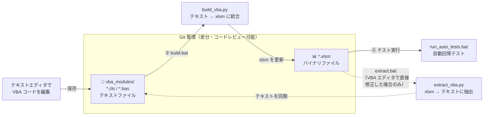
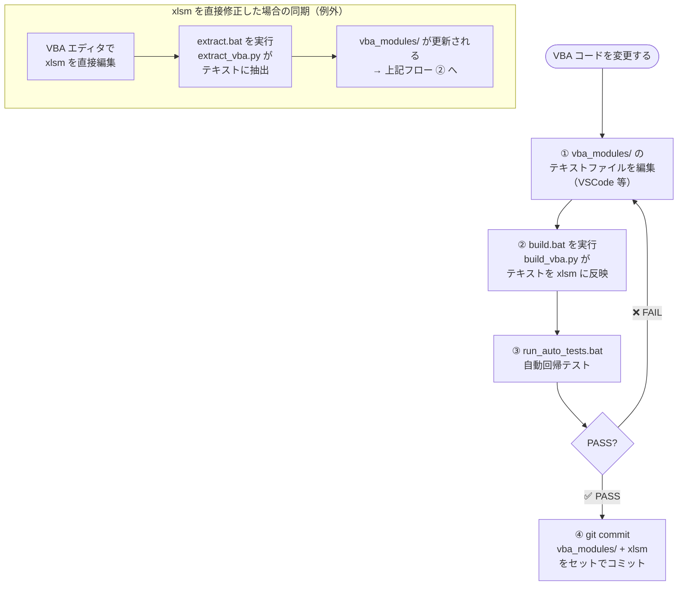

# VBA Text-Based Development Environment

Excel VBA ツールをテキストベースで開発するための**汎用的な**環境です。

## 背景・課題

Excel VBA マクロには以下の課題があります：

- **バイナリ形式**: VBA コードは xlsm ファイル内にバイナリ形式で埋め込まれる
- **差分が見えない**: Git 等のバージョン管理システムで変更内容を追跡できない
- **レビューが困難**: コードレビュー時に差分を確認できないため、品質管理が難しい

## 解決策

この環境では、VBA コードを以下のワークフローで管理します：

1. **VBA抽出**: xlsm ファイルから VBA コードをテキストファイルに抽出
2. **テキスト編集**: 通常のテキストエディタで VBA コードを編集
3. **VBAビルド**: 編集したテキストファイルを xlsm ファイルにマージ
4. **Git管理**: テキストファイルを Git でバージョン管理（差分・レビューが可能）

## 仕組みの概要

### ファイル構成と変換の関係



実線が**通常の開発フロー**（テキスト編集 → ビルド → テスト）、破線が**例外フロー**（xlsm を直接修正した後の同期）です。

### 開発フロー



> **注意**: xlsm 単体でのコミットは差分が見えないため禁止です。必ず `vba_modules/` と `xlsm` をセットでコミットしてください。

## ディレクトリ構造

```text
review-support-tool/
├── vba-text-based-dev/      # VBA開発環境（汎用）
│   ├── README.md
│   └── scripts/
│       ├── windows/         # Windows用スクリプト
│       │   ├── extract.bat  # VBA抽出
│       │   └── build.bat    # VBAビルド
│       ├── wsl2/            # WSL2用スクリプト
│       │   ├── extract.sh   # VBA抽出
│       │   └── build.sh     # VBAビルド
│       ├── extract_vba.py   # VBA抽出Pythonスクリプト
│       └── build_vba.py     # VBAビルドPythonスクリプト
├── doctool/
│   ├── win-config.bat       # Windows用設定
│   ├── wsl2-config.mk       # WSL2用設定
│   ├── vba_modules/         # VBAテキストファイル（doctool用）
│   └── Excel設計書レビュー指摘事項抽出ツール/
│       └── *.xlsm
└── prtool/
    ├── win-config.bat       # Windows用設定
    ├── wsl2-config.mk       # WSL2用設定
    ├── vba_modules/         # VBAテキストファイル（prtool用）
    └── プルリクエストコメント抽出ツール/
        └── *.xlsm
```

各プロジェクトに環境別の設定ファイルと VBA テキストファイルを配置します。

## 前提条件

- Python 3.10 以上（Windows）
- 必要なライブラリ（`requirements-windows.txt`）：

  ```cmd
  pip install -r vba-text-based-dev\requirements-windows.txt
  ```

インストール確認：

```cmd
python -c "import oletools; print('oletools OK')"
python -c "import win32com.client; print('pywin32 OK')"
```

## 使い方

### 1. プロジェクトの設定ファイルを作成

プロジェクトディレクトリに `win-config.bat` を作成します：

```bat
@echo off
REM VBA Text-Based Dev Configuration

REM xlsmファイルのパス
set XLSM_FILE=%~dp0path\to\tool.xlsm

REM VBA出力ディレクトリ
set VBA_OUTPUT_DIR=%~dp0vba_modules
```

`%~dp0` は設定ファイルが配置されているディレクトリのパスです。

### 2. VBA抽出

xlsm ファイルから VBA コードをテキストファイルに抽出します：

**バッチファイルを使用（推奨）**:

```cmd
cd vba-text-based-dev\scripts\windows
extract.bat ..\..\..\doctool\win-config.bat
```

または、Python スクリプトを直接実行：

```cmd
cd vba-text-based-dev
python scripts\extract_vba.py C:\path\to\tool.xlsm C:\path\to\vba_modules
```

**出力**: 指定した VBA 出力ディレクトリに各 VBA モジュールがテキストファイルとして保存されます。

### 3. VBA編集

VBA 出力ディレクトリ配下のテキストファイルを任意のエディタで編集します：

- Visual Studio Code
- Notepad++
- メモ帳
- など

### 4. VBAビルド

編集したテキストファイルを xlsm ファイルにマージします：

**バッチファイルを使用（推奨）**:

```cmd
cd vba-text-based-dev\scripts\windows
build.bat ..\..\..\doctool\win-config.bat
```

または、Python スクリプトを直接実行：

```cmd
cd vba-text-based-dev
python scripts\build_vba.py C:\path\to\vba_modules C:\path\to\tool.xlsm
```

### 5. テスト実行

ビルド後の xlsm ファイルを Excel で開いて動作確認します：

1. エクスプローラーで xlsm ファイルの場所を開く
2. xlsm ファイルをダブルクリック
3. マクロを有効化して動作確認

### 6. Git管理

VBA テキストファイルをコミットします：

```cmd
git add doctool\vba_modules\
git commit -m "feat: Update VBA code"
```

## トラブルシューティング

### 設定ファイルが指定されていない

**エラー**: `❌ エラー: 設定ファイルのパスを指定してください`

**解決策**:

バッチファイルの第 1 引数に設定ファイルのパスを指定してください：

```cmd
cd vba-text-based-dev\scripts\windows
extract.bat ..\..\..\doctool\win-config.bat
```

### oletoolsが見つからない

**エラー**: `ModuleNotFoundError: No module named 'oletools'`

**解決策**:

```cmd
pip install -r vba-text-based-dev\requirements-windows.txt
```

### pywin32が見つからない

**エラー**: `ModuleNotFoundError: No module named 'win32com'`

**解決策**:

```cmd
pip install -r vba-text-based-dev\requirements-windows.txt
```

### xlsmファイルが壊れた

**症状**: ビルド後に Excel で開くとエラー、またはコンパイルエラー

**解決策**:

Git 履歴から復元します：

```cmd
git restore doctool\Excel設計書レビュー指摘事項抽出ツール\Excel設計書レビュー指摘事項抽出ツール.xlsm
```

### Excelが既に開いている

**エラー**: `'NoneType' object has no attribute 'VBProject'`

**解決策**:

1. Excel をすべて閉じる
2. タスクマネージャーで `EXCEL.EXE` プロセスを確認・終了
3. 再度ビルドを実行

### バッチファイルが文字化けする

**症状**: Windows 環境でバッチファイル実行時に日本語が文字化けする

```text
'��のパス' is not recognized as an internal or external command
[ERROR] エラー: 設定ファイルでXLSM_FILEが設定されていません
```

**原因**: バッチファイルが UTF-8 エンコーディングで保存されている

**解決策**:

Windows バッチファイル（`*.bat`）は**Shift-JIS（CP932）エンコーディング**で保存する必要があります。

WSL2/Linux 環境で編集した場合は、以下のコマンドで Shift-JIS に変換してください：

```bash
# UTF-8からShift-JISに変換
iconv -f UTF-8 -t CP932 input.bat > output.bat

# 絵文字（❌、✅など）は事前に置換が必要
sed -e 's/❌/[ERROR]/g' -e 's/✅/[OK]/g' input.bat | iconv -f UTF-8 -t CP932 > output.bat
```

**注意事項**:

- バッチファイルは**Shift-JIS + CRLF改行**で保存してください
- `.gitattributes` で CRLF 改行は自動設定されています
- UTF-8 で編集すると文字化けするため、WSL2 での編集時は注意が必要です

## アディショナルな開発環境

WSL2 環境で Makefile を活用した開発も可能です。詳細は [WSL2_SETUP.md](./WSL2_SETUP.md) を参照してください。

スクリプトの技術的な詳細は [scripts/README.md](./scripts/README.md) を参照してください。
