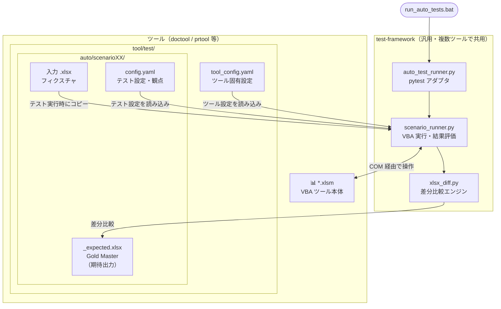
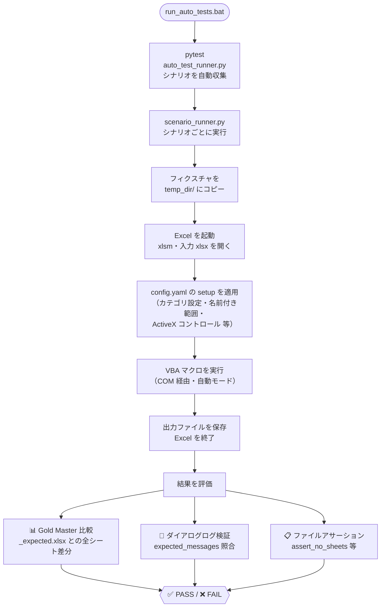
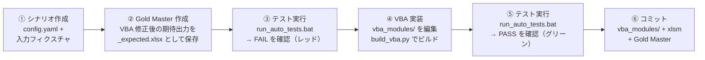

# VBA 自動テストフレームワーク

Excel VBA マクロ（xlsm）を対象とした Gold Master テストフレームワーク。
`doctool`、`prtool` など複数のツールで共用できるよう、ツール固有の設定は
各ツールの `test/tool_config.yaml` に分離している。

## 仕組みの概要

### コンポーネント構成



### テスト実行フロー

1回のシナリオ実行で何が起きるかを示します。



### テストファースト開発サイクル



## ディレクトリ構成

```
test-framework/
└── scripts/
    ├── scenario_runner.py     # VBA 実行・結果評価のコアロジック
    ├── auto_test_runner.py    # pytest アダプタ（自動テスト）
    ├── manual_test_runner.py  # 対話型ランナー（手動テスト）
    ├── conftest.py            # pytest 共通設定・セッションログ
    ├── test_runner.py         # 自動＋手動をまとめて実行するオーケストレーター
    └── helpers/
        ├── config_loader.py   # config.yaml の読み込み・バリデーション
        ├── fixture_manager.py # フィクスチャのコピー管理
        ├── tee_logger.py      # stdout をコンソールとファイルに同時出力
        ├── xlsx_diff.py       # xlsx ファイルの差分比較
        └── xlsx_assertions.py # xlsx に対するアサーションヘルパー
```

## ツール側の準備

各ツールの `test/` ディレクトリに以下を用意する。

### `tool_config.yaml`

```yaml
xlsm_path: "../<ツール名>/<ツール名>.xlsm"  # test/ からの相対パス
xlsm_name: "<ツール名>.xlsm"
```

### ディレクトリ構成

```
<tool>/test/
├── tool_config.yaml   # ← ツール固有設定
├── auto/              # 自動テストシナリオ
│   ├── scenario01/
│   │   ├── config.yaml
│   │   ├── <入力>.xlsx
│   │   └── <入力>_expected.xlsx
│   └── ...
├── manual/            # 手動テストシナリオ
│   └── ...
├── temp_dir/          # テスト実行時の作業領域（Git 管理外）
├── run_auto_tests.bat
├── run_manual_tests.bat
└── run_tests.bat
```

### `.bat` ファイルの共通パターン

```bat
cd /d %~dp0
set TOOL_TEST_ROOT=%~dp0
set FRAMEWORK=..\..\vba-text-based-dev\test-framework\scripts
python -m pytest %FRAMEWORK%\auto_test_runner.py -v --tb=short -s
```

## `config.yaml` のキー一覧

| キー | 型 | 説明 |
|------|----|------|
| `viewpoint` | string | テスト観点の説明（ログ表示用） |
| `mode` | string | `"manual"` で手動モード、省略で自動モード |
| `steps` | list | 実行ステップ（必須）|
| `setup` | dict | VBA 実行前の設定（`use_review_record`, `categories` など） |
| `skip_open_files` | list | Python が開かないファイルの正規表現パターン |
| `file_expectations` | list | `assert_no_sheets` などのファイル単位アサーション |
| `excluded_cells` | list | Gold Master 比較から除外するセル参照 |
| `template_assertions` | list | xlsm テンプレートシートへのアサーション |
| `expected_messages` | list | 期待するダイアログメッセージ ID（`[MSG:XX]` 形式） |

### `steps` の `action` 一覧

| action | 説明 |
|--------|------|
| `extract` | 指摘事項抽出マクロを実行（`review_times` 必須） |
| `delete_comments` | コメント一括削除マクロを実行 |
| `delete_sheets` | 結果シート一括削除マクロを実行 |

## 環境変数

| 変数 | 説明 |
|------|------|
| `TOOL_TEST_ROOT` | ツールの `test/` ディレクトリへの絶対パス。`.bat` が自動設定する |
