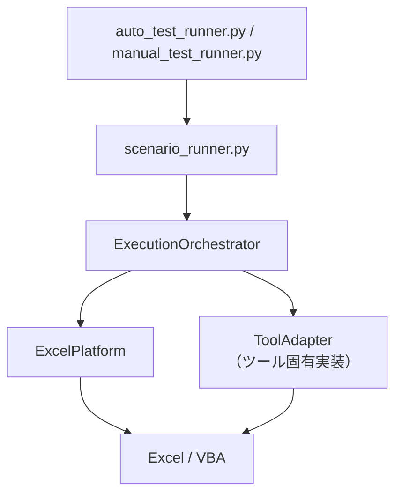

# ToolAdapter 利用者ガイド

汎用テストエンジンに新しい VBA ツールを追加するための手順書。

## 1. 概要

テストフレームワークは「汎用エンジン」と「ツール固有アダプタ」に分離されている。
汎用エンジン（`ExecutionOrchestrator` / `ExcelPlatform`）は Excel ライフサイクルとシナリオ実行フローを管理し、
ツール固有の処理は `ToolAdapter` を実装したアダプタクラスに委譲される。



**ToolAdapter が担うもの:**

| メソッド | 役割 |
|---------|------|
| `get_macro_entry_point()` | メインマクロのパスを返す |
| `apply_setup()` | xlsm 事前設定（シート書き込み等） |
| `execute_steps()` | 各ステップのアクション実装 |
| `pre_macro_hook()` | マクロ実行前の処理 |
| `post_macro_hook()` | マクロ実行後の処理 |
| `get_default_comparison()` | Gold Master 比較のデフォルト設定 |
| `evaluate_custom_assertions()` | ツール固有アサーション評価 |

---

## 2. 新しい VBA ツールの追加手順

### 2.1 ディレクトリ構成

対象ツールのリポジトリに以下の構成を作成する。

```
<ツールリポジトリ>/
  <ツール名>.xlsm            ← テスト対象の xlsm ファイル
  test/
    tool_config.yaml         ← ツール固有設定（xlsm パス・アダプタ指定）
    auto/
      scenario01/
        config.yaml          ← シナリオ定義
        input.xlsx           ← 入力ファイル
        input_expected.xlsx  ← Gold Master（変更禁止）
      scenario02/
        ...
    manual/
      scenario01/
        config.yaml
        ...
    temp_dir/                ← テスト実行時に自動生成（.gitignore 推奨）
```

### 2.2 アダプタクラスの作成

`vba-text-based-dev/test-framework/scripts/adapters/` に新しいファイルを作成する。

```python
# adapters/mytool_adapter.py
from __future__ import annotations
from pathlib import Path
from typing import Any, Dict, List

from adapters import BaseToolAdapter, ComparisonConfig


class MyToolAdapter(BaseToolAdapter):
    """MyTool 用テストアダプタ。"""

    XLSM_NAME = "MyTool.xlsm"

    # ---- 必須メソッド ----

    def get_macro_entry_point(self) -> str:
        return "Sheet1.RunMain"

    def execute_steps(
        self,
        scenario_name: str,
        xlsm_wb: Any,
        steps: List[Dict[str, Any]],
        test_mode: bool,
        work_dir: Path,
        platform: Any,
    ) -> None:
        macro = xlsm_wb.macro(self.get_macro_entry_point())
        for step_idx, step in enumerate(steps, 1):
            action = step["action"]
            if action == "run":
                print(f"[{scenario_name}] Step {step_idx}: run")
                platform.run_macro_with_retry(scenario_name, macro, test_mode)

    # ---- オプションメソッド（必要に応じてオーバーライド）----

    def apply_setup(self, scenario_name, xlsm_wb, setup, work_dir):
        # config.yaml の setup セクションに対応する処理
        pass

    def get_default_comparison(self) -> ComparisonConfig:
        # ツールに合わせて比較項目を調整
        return ComparisonConfig(print_area=False, fill_colors=False)

    def evaluate_custom_assertions(self, work_dir, assertions):
        # ツール固有のアサーション評価（不要なら省略可）
        return []
```

**必須メソッド:** `get_macro_entry_point()` と `execute_steps()`
**オプションメソッド:** それ以外（`BaseToolAdapter` がデフォルトの no-op を提供）

### 2.3 tool_config.yaml の設定

`test/tool_config.yaml` を作成し、xlsm パスとアダプタクラスを指定する。

```yaml
# test/tool_config.yaml
xlsm_path: "../MyTool.xlsm"   # test/ からの相対パス
xlsm_name: "MyTool.xlsm"

adapter:
  module: "adapters.mytool_adapter"
  class: "MyToolAdapter"
```

`xlsm_path` は `TOOL_TEST_ROOT`（`test/` ディレクトリ）からの相対パスで指定する。

### 2.4 config.yaml のシナリオ定義

各シナリオディレクトリに `config.yaml` を作成する。

```yaml
# test/auto/scenario01/config.yaml
viewpoint: "基本動作確認"

# xlsm 事前設定（apply_setup に渡る）
setup:
  some_flag: true

# 実行ステップ（execute_steps に渡る）
steps:
  - action: run
    some_param: "value"

# Gold Master 比較のカスタマイズ（get_default_comparison とマージ）
compare:
  fill_colors: false   # このシナリオのみ背景色比較を無効化

# 除外セル（Gold Master 比較から除外）
excluded_cells:
  - "Sheet1!A1"

# ファイル固有アサーション（Gold Master 比較の代わり）
file_expectations:
  - pattern: "output.*\\.xlsx"
    assert_no_sheets:
      - "削除済みシート名"
```

---

## 3. メソッド別実装ガイド

### `get_macro_entry_point() -> str` ★必須

メインマクロの VBA パスを返す。

```python
def get_macro_entry_point(self) -> str:
    return "Sheet1.RunCore"   # Module名.マクロ名
```

### `execute_steps(...)` ★必須

config.yaml の `steps` リストを受け取り、各アクションを実行する。
`platform.run_macro_with_retry()` を使うと COM ビジー時の自動リトライが有効になる。

```python
def execute_steps(self, scenario_name, xlsm_wb, steps, test_mode, work_dir, platform):
    macro = xlsm_wb.macro(self.get_macro_entry_point())
    for step_idx, step in enumerate(steps, 1):
        action = step["action"]
        if action == "run":
            platform.run_macro_with_retry(scenario_name, macro, test_mode)
        elif action == "reset":
            xlsm_wb.macro("Module1.Reset")()
        else:
            raise ValueError(f"Unknown action: {action}")
```

### `apply_setup(scenario_name, xlsm_wb, setup, work_dir) -> None` オプション

config.yaml の `setup:` セクションの内容を xlsm に適用する。
省略した場合は何もしない（`BaseToolAdapter` のデフォルト）。

```python
def apply_setup(self, scenario_name, xlsm_wb, setup, work_dir):
    ws = xlsm_wb.sheets["設定"]
    if "flag" in setup:
        ws["B1"].value = setup["flag"]
```

### `pre_macro_hook(scenario_name, xlsm_wb, step, work_dir) -> None` オプション

マクロ実行前に呼ばれる。ステップ固有の準備処理に使用する。
`step` dict から `action` や追加パラメータを取得できる。

```python
def pre_macro_hook(self, scenario_name, xlsm_wb, step, work_dir):
    if step.get("action") == "run" and "categories" in step:
        # ステップ固有のカテゴリを設定
        ...
```

### `post_macro_hook(scenario_name, xlsm_wb, step, work_dir) -> None` オプション

マクロ実行後に呼ばれる。ログ取得等の後処理に使用する。

### `get_default_comparison() -> ComparisonConfig` オプション

ツールに適した Gold Master 比較のデフォルト設定を返す。
省略した場合は全項目 `True`（`BaseToolAdapter` のデフォルト）。
`config.yaml` の `compare:` セクションで上書き可能（`values` は上書き不可）。

```python
def get_default_comparison(self) -> ComparisonConfig:
    return ComparisonConfig(
        print_area=False,   # 印刷範囲は比較しない
        fill_colors=False,  # 背景色は比較しない
    )
```

`ComparisonConfig` のフィールド:

| フィールド | デフォルト | 説明 |
|-----------|-----------|------|
| `values` | `True` | セル値（上書き不可） |
| `formulas` | `True` | 数式 |
| `comments` | `True` | コメント（メモ） |
| `borders` | `True` | 罫線 |
| `column_widths` | `True` | 明示設定された列幅 |
| `print_area` | `True` | 印刷範囲 |
| `fill_colors` | `True` | 背景色（塗りつぶし） |

### `evaluate_custom_assertions(work_dir, assertions) -> list[str]` オプション

config.yaml の `template_assertions:` 等、ツール固有のアサーションを評価する。
エラーがない場合は空リストを返す。
省略した場合は常に空リスト（`BaseToolAdapter` のデフォルト）。

---

## 4. DoctoolAdapter リファレンス

`adapters/doctool_adapter.py` の DoctoolAdapter は実装例として参照できる。

### マクロパスのアクセサ

```python
adapter = DoctoolAdapter()

adapter.get_macro_entry_point()
# => "Sheet1.CmdGen_Click_Core"

adapter.get_clear_log_macro()
# => "Module2.ClearDialogLog"

adapter.get_dialog_log_vba_function()
# => "Module2.GetDialogLog"

adapter.get_delete_macro_path("delete_comments")
# => "Module2.DelAllReviewComments_Click_Core"

adapter.get_delete_macro_path("delete_sheets")
# => "Module2.DelAllReviewResultSheets_Click_Core"
```

### execute_steps で処理するアクション

| action | 動作 |
|--------|------|
| `extract` | メインマクロ（CmdGen_Click_Core）を実行。ダイアログログを取得 |
| `delete_comments` | コメント削除マクロを実行 |
| `delete_sheets` | シート削除マクロを実行 |

### config.yaml の setup キー（doctool 固有）

| キー | 説明 |
|-----|------|
| `use_review_record` | 基本設定シート B2 に設定 |
| `use_summary` | 基本設定シート B3 に設定 |
| `review_list_file` | REVIEW_LIST_FILEPATH 名前付き範囲にパスを設定 |
| `categories` | 指摘分類マッピング設定シートをリストで上書き |
| `named_ranges` | 任意の名前付き範囲に値を設定 |
| `item_mapping_cells` | 項目マッピング設定シートの個別セルに値を設定 |

### template_assertions（doctool 固有）

```yaml
template_assertions:
  - sheet: "レビュー結果シートテンプレート"
    category_count: 3
    cell_formula_contains:
      - cell: "C8"
        contains: "VLOOKUP"
```
